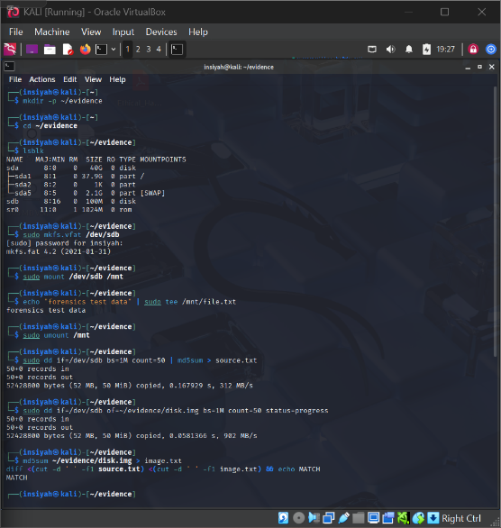
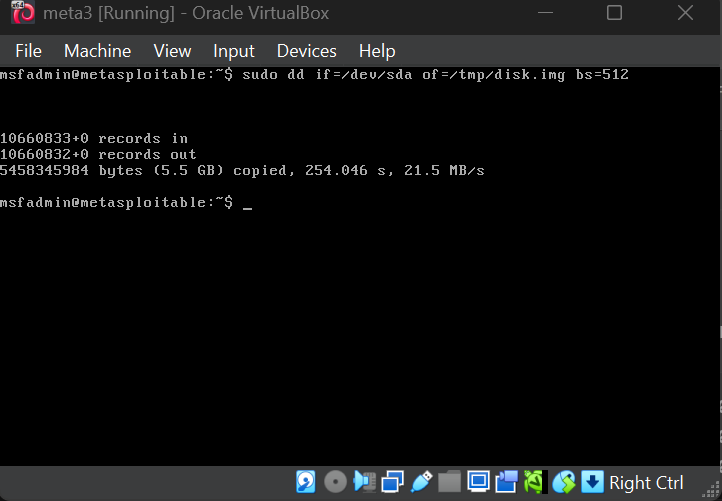
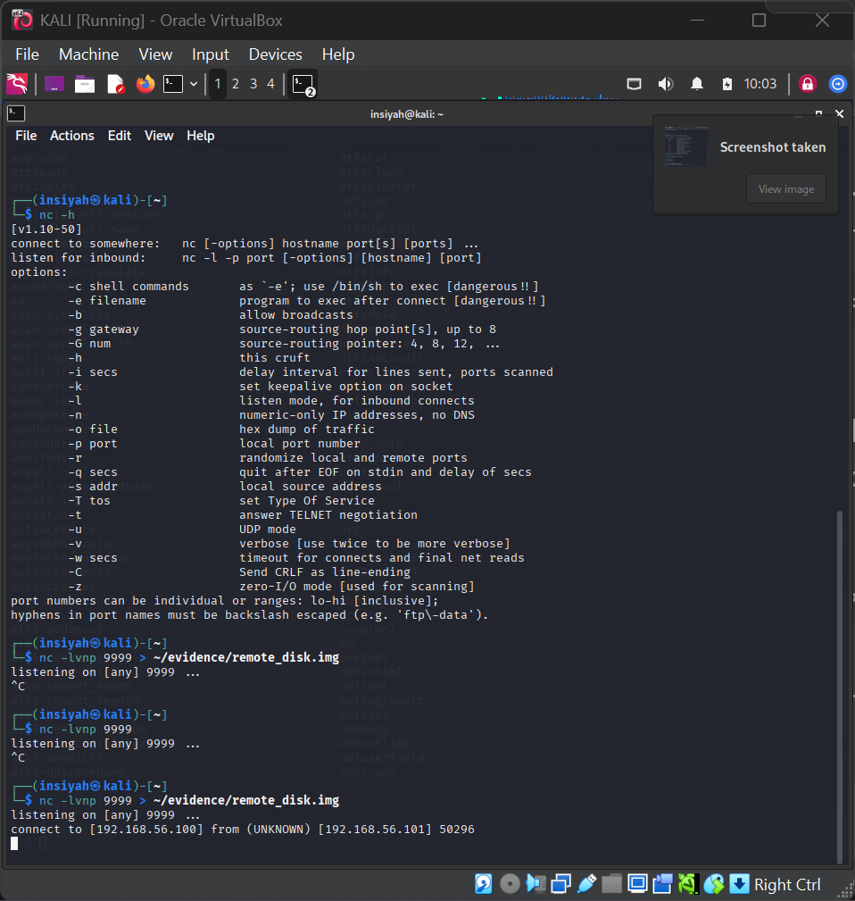
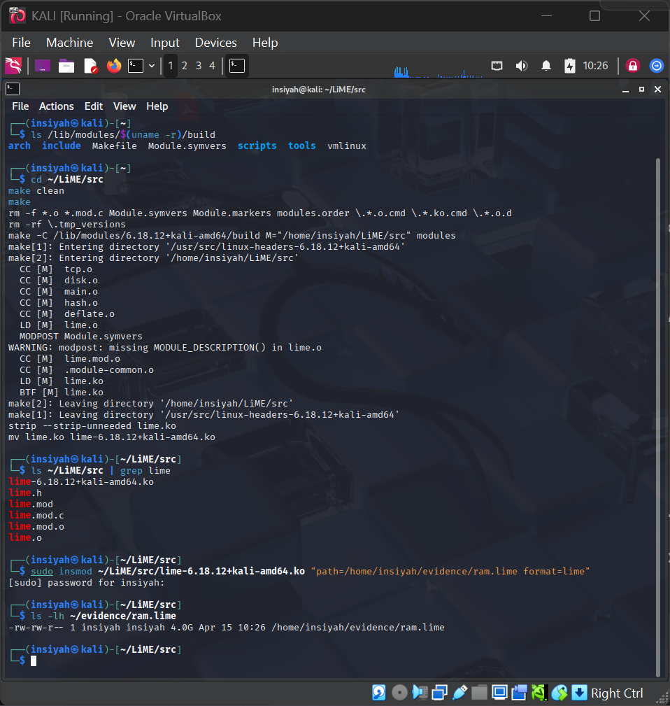

# Lab 01 — Static and Live Data Acquisition

**Tools:** FTK Imager · `dd` · `LiME` · `dc3dd` · `md5sum`  
**Platform:** Kali Linux

---

## Aim

To perform static and live data acquisition using FTK Imager and Linux command-line tools.

## Theory

Digital forensics begins with evidence acquisition — capturing data from storage media without altering the original. Two types are performed:

- **Static Acquisition** — imaging a powered-off disk (bit-for-bit copy)
- **Live Acquisition** — capturing volatile memory (RAM) from a running system

Hash verification (MD5/SHA-256) ensures the acquired image is a forensically sound, unmodified copy of the source.

---

## Procedure

### Static Disk Imaging (Linux)

**Step 1 — Setup**
```bash
sudo apt update && sudo apt install dc3dd -y
mkdir -p ~/evidence && cd ~/evidence
```

**Step 2 — Identify the target drive**
```bash
lsblk
sudo hdparm -r1 /dev/sdb     # write-protect the source
```

**Step 3 — Hash the source BEFORE imaging**
```bash
sudo md5sum /dev/sdb | tee ~/evidence/source_md5.txt
```

**Step 4 — Create the disk image**
```bash
sudo dd if=/dev/sdb of=~/evidence/disk.img bs=512 conv=noerror,sync status=progress
```

**Step 5 — Verify the image hash**
```bash
md5sum ~/evidence/disk.img | tee ~/evidence/image_md5.txt
diff ~/evidence/source_md5.txt ~/evidence/image_md5.txt && echo MATCH || echo MISMATCH
```

### Live Acquisition — RAM Dump (LiME)

**Step 6 — Build and load LiME**
```bash
sudo apt install linux-headers-$(uname -r) build-essential git -y
git clone https://github.com/504ensicsLabs/LiME.git ~/LiME
cd ~/LiME/src && make
sudo insmod ~/LiME/src/lime-$(uname -r).ko "path=~/evidence/ram.lime format=lime"
ls -lh ~/evidence/ram.lime
sudo rmmod lime
```

---

## Screenshots

| Step | Screenshot |
|------|------------|
| Setup & drive detection |  |
| Source hash generation |  |
| Disk imaging in progress |  |
| Hash verification / RAM dump |  |

---

## Conclusion

Static acquisition created a forensically sound disk image without modifying the original drive. Live acquisition captured volatile RAM using LiME. Hash comparison confirmed data integrity throughout the process.
