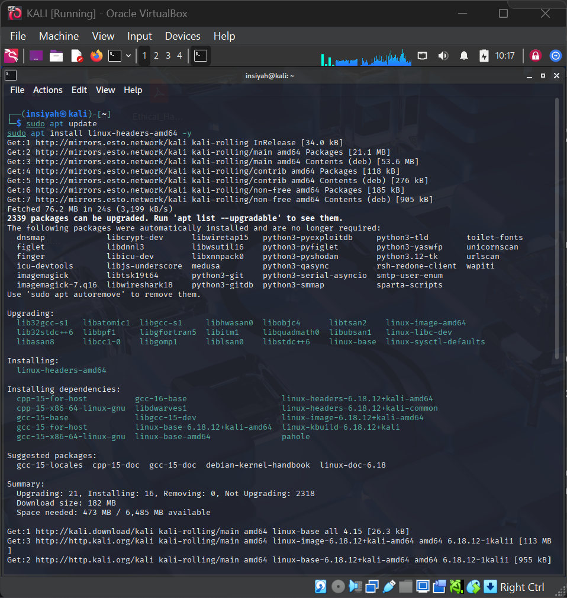
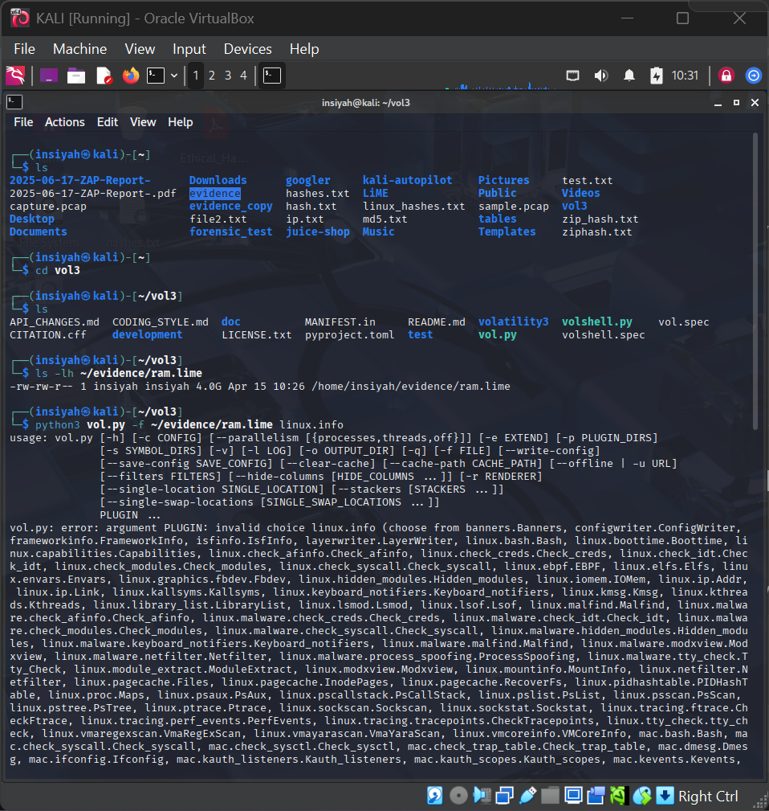
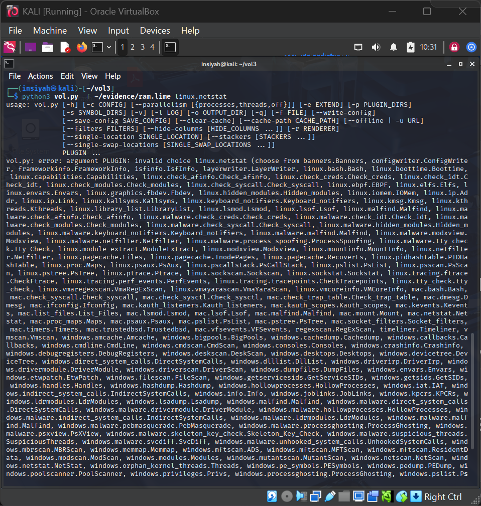
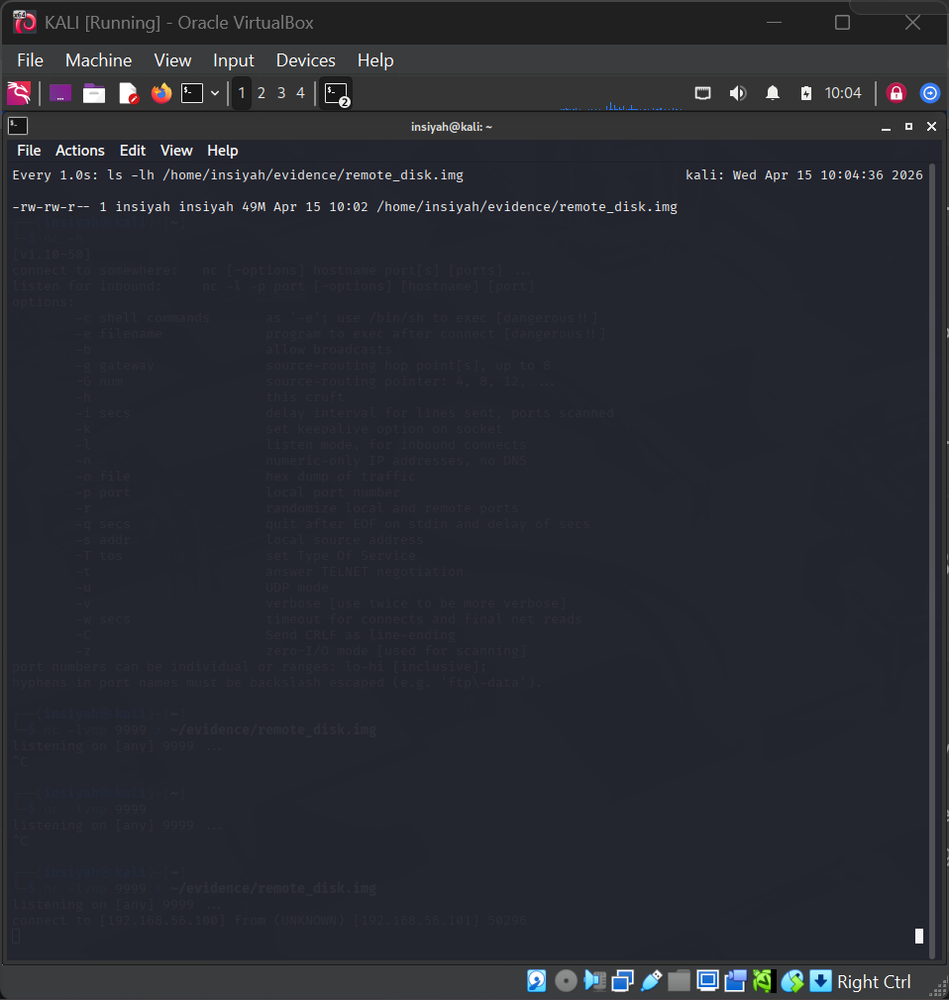

# Lab 02 — RAM Analysis using Volatility

**Tools:** Volatility 3 · Kali Linux  
**Platform:** Kali Linux

---

## Aim

To install Kali Linux and perform RAM analysis using Volatility to identify running processes and network activity.

## Theory

Memory forensics involves analyzing a RAM dump to extract volatile artifacts that are lost when a system powers off — including running processes, active network connections, open files, and bash command history. Volatility is the industry-standard framework for this analysis, supporting both Linux and Windows memory images.

---

## Procedure

**Step 1 — Update and install forensics tools**
```bash
sudo apt update && sudo apt full-upgrade -y
sudo apt install kali-tools-forensics -y
```

**Step 2 — Install Volatility 3**
```bash
git clone https://github.com/volatilityfoundation/volatility3.git ~/volatility3
cd ~/volatility3 && pip3 install -r requirements.txt --break-system-packages
```

**Step 3 — Analyse Linux RAM dump** *(use `ram.lime` from Lab 01)*
```bash
export DUMP=~/evidence/ram.lime
volatility -f $DUMP imageinfo
volatility -f $DUMP --profile=LinuxKali-5_15_0x64 linux_pslist
volatility -f $DUMP --profile=LinuxKali-5_15_0x64 linux_netstat
volatility -f $DUMP --profile=LinuxKali-5_15_0x64 linux_bash
```

**Step 4 — Windows RAM Dump analysis (Volatility 3)**
```bash
export WDUMP=~/evidence/windows.mem
python3 ~/volatility3/vol.py -f $WDUMP windows.pslist
python3 ~/volatility3/vol.py -f $WDUMP windows.psscan
python3 ~/volatility3/vol.py -f $WDUMP windows.netscan
```

---

## Screenshots

| Step | Screenshot |
|------|------------|
| Volatility install & setup |  |
| `imageinfo` — profile detection |  |
| `linux_pslist` — process listing |  |
| `linux_netstat` — network connections |  |

---

## Conclusion

RAM analysis using Volatility successfully revealed active processes and network connections from the memory dump. Memory forensics is critical for detecting malware, unauthorized access, and other live system threats that leave no disk trace.
