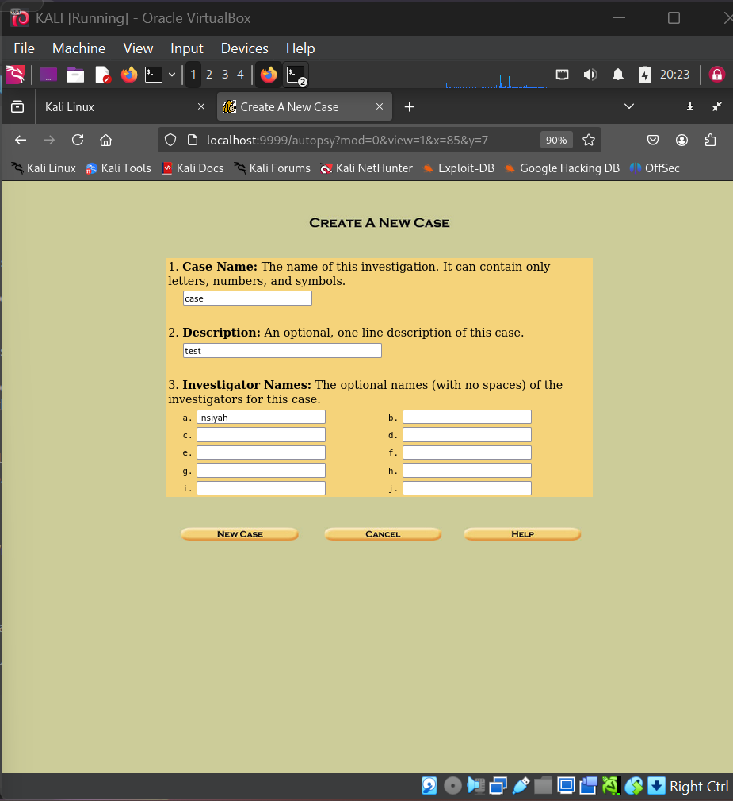
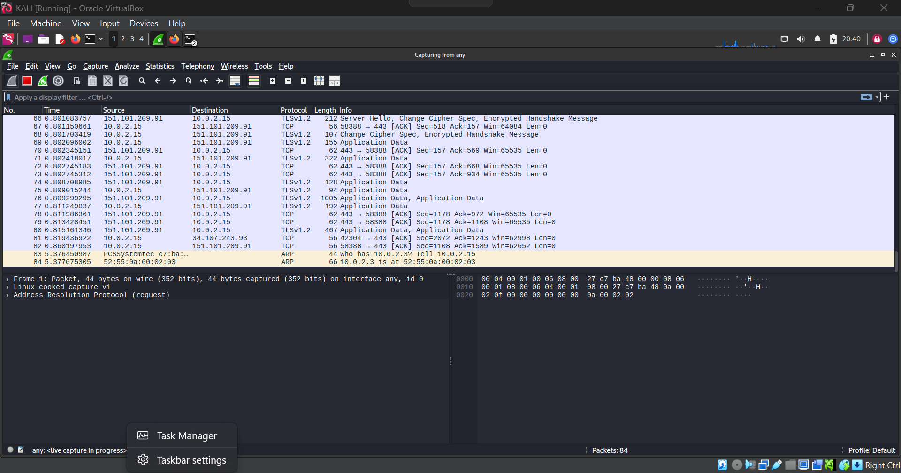

# Lab 03 — Study of Digital Forensics Tools

**Tools:** Autopsy · Wireshark · Volatility · Foremost · Bulk Extractor · Hashdeep · John the Ripper · Dmitry  
**Platform:** Kali Linux / Windows

---

## Aim

To study and compare various digital forensics tools used for disk, memory, and network analysis.

## Theory

A forensic investigator uses different tools depending on the investigation type. Key categories include:

| Category | Tools |
|----------|-------|
| Disk Imaging | FTK Imager, EnCase, `dd` |
| Memory Analysis | Volatility |
| Disk/File Analysis | Autopsy, Sleuth Kit |
| Network Capture | Wireshark, tcpdump |
| Password Cracking | John the Ripper, Hashcat |
| Data Carving | Foremost, Bulk Extractor |
| Hashing | Hashdeep, `md5sum` |
| OSINT/Recon | Dmitry |

---

## Procedure

**Check all tools are installed**
```bash
for tool in autopsy volatility wireshark tcpdump foremost bulk_extractor hashdeep dmitry john; do
  printf "%-15s " "$tool"
  which "$tool" 2>/dev/null || echo "NOT FOUND"
done
sudo apt install kali-tools-forensics autopsy foremost bulk-extractor hashdeep dmitry john -y
```

**Quick tool verification**
```bash
autopsy --version 2>&1 | head -3
wireshark --version | head -2
volatility --info 2>/dev/null | grep -E '^(Linux|Win|Mac)' | head -20
foremost -V
bulk_extractor --version
hashdeep -h 2>&1 | head -10
john --version
ettercap --version | head -3
```

---

## Screenshots

| Step | Screenshot |
|------|------------|
| Autopsy Digital Forensics Platform (Web Interface) |  |
| Wireshark Network Traffic Capture & Analysis |  |

---

## Conclusion

The study covered tools across all major forensic categories — disk imaging, memory analysis, network capture, data carving, and password cracking. Understanding each tool's purpose and output is essential for building a complete forensic investigation workflow.
