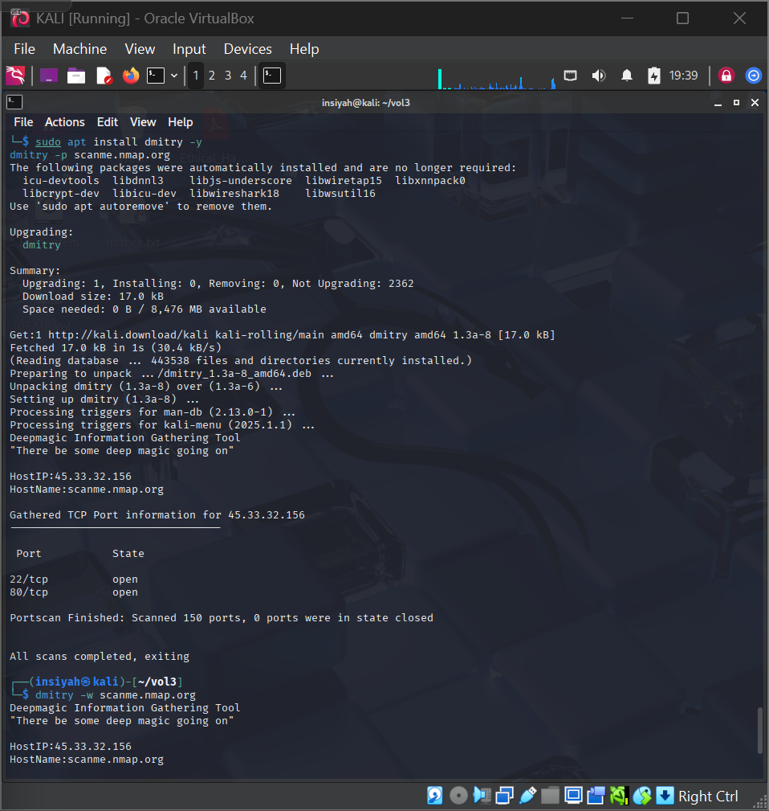
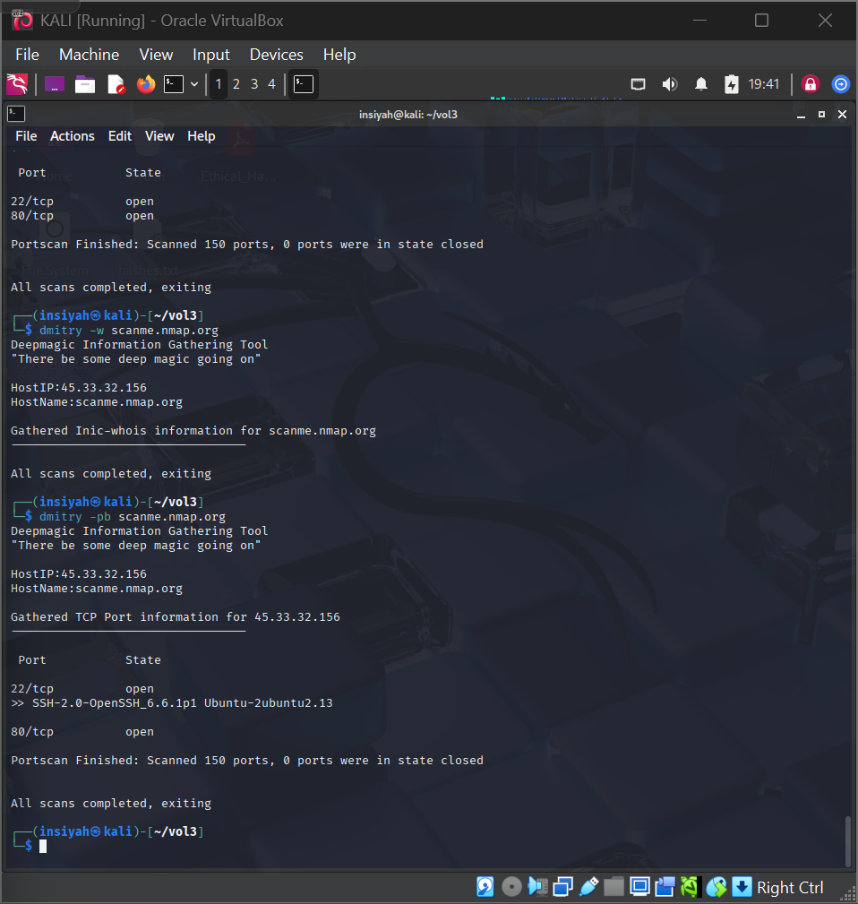
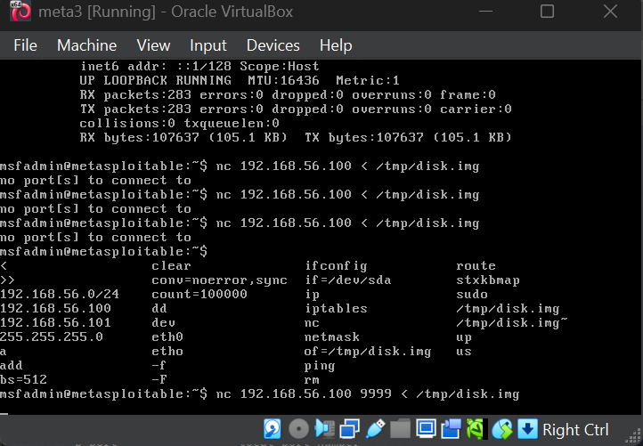
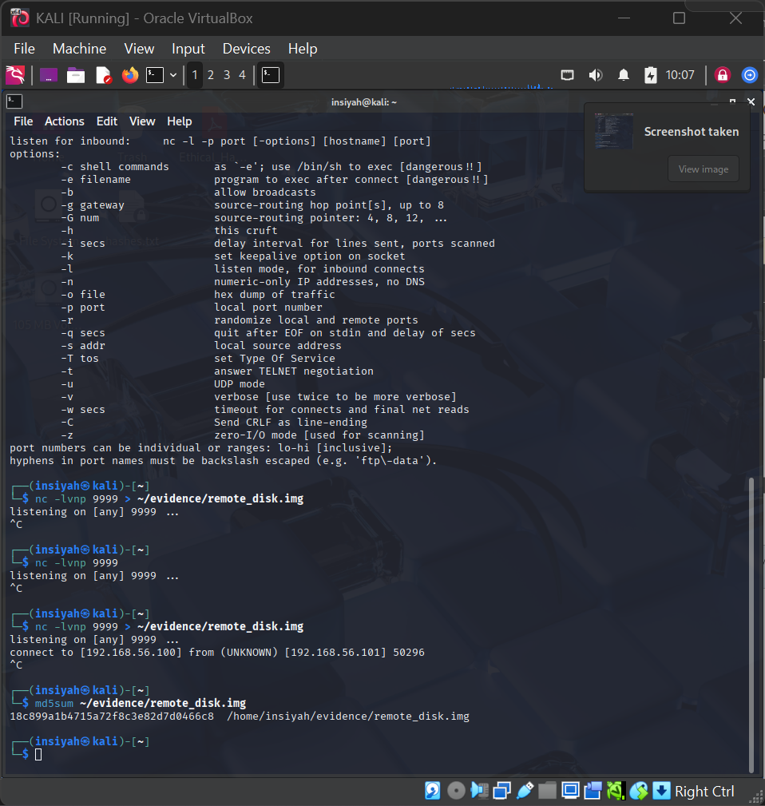

# Lab 04 — Information Gathering using Dmitry

**Tools:** Dmitry (Deepmagic Information Gathering Tool)  
**Platform:** Kali Linux

---

## Aim

To perform information gathering using Dmitry to collect domain details, WHOIS data, open ports, and subdomains.

## Theory

Information gathering (OSINT) is the first phase of any forensic or penetration investigation. Dmitry automates the collection of:
- WHOIS domain registration data
- Open TCP ports (active services)
- Subdomain enumeration
- Email address harvesting

---

## Procedure

**Install Dmitry**
```bash
sudo apt install dmitry -y
```

**Full scan — saves all output to a report file**
```bash
dmitry -winsepfb -o ~/evidence/dmitry_report scanme.nmap.org
cat ~/evidence/dmitry_report.txt
```

**Individual scans**
```bash
dmitry -w scanme.nmap.org     # WHOIS lookup
dmitry -s scanme.nmap.org     # Subdomain search
dmitry -e scanme.nmap.org     # Email harvesting
dmitry -p scanme.nmap.org     # Port scan
dmitry -pb scanme.nmap.org    # Port scan + banner grab
```

**Filter results**
```bash
grep -i 'open tcp' ~/evidence/dmitry_report.txt
```

### Dmitry Flag Reference

| Flag | Function |
|------|----------|
| `-w` | WHOIS lookup |
| `-i` | IP WHOIS |
| `-n` | Netcraft info |
| `-s` | Subdomain search |
| `-e` | Email address search |
| `-p` | Port scan |
| `-f` | Filter results |
| `-b` | Banner grab |
| `-o` | Save output to file |

---

## Screenshots

| Step | Screenshot |
|------|------------|
| Dmitry installation & TCP port scanning |  |
| WHOIS domain info & service banner grabbing |  |
| Remote evidence transfer from target (Metasploitable) |  |
| Remote acquisition completion & integrity check |  |

---

## Conclusion

Dmitry successfully gathered domain registration details, open ports, and subdomain information. This kind of passive reconnaissance is a critical first step in any forensic or security investigation.
