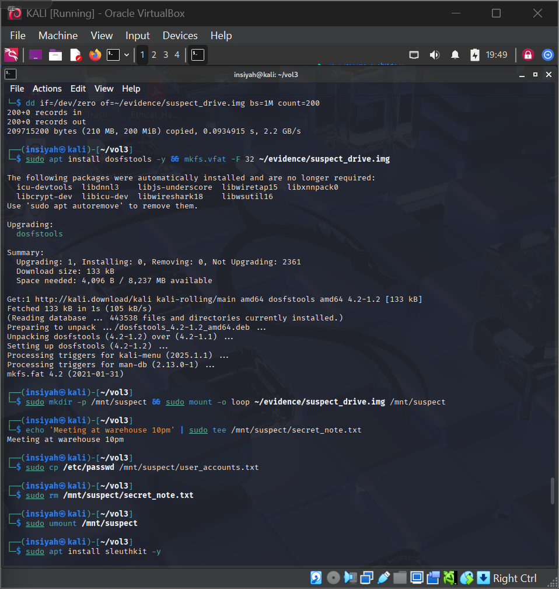
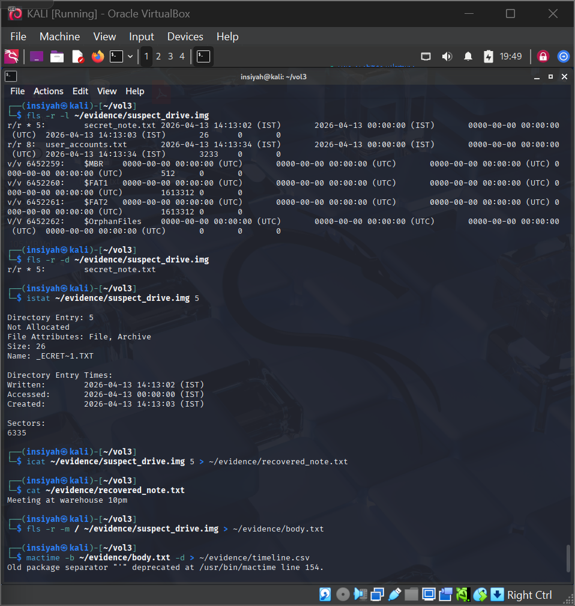
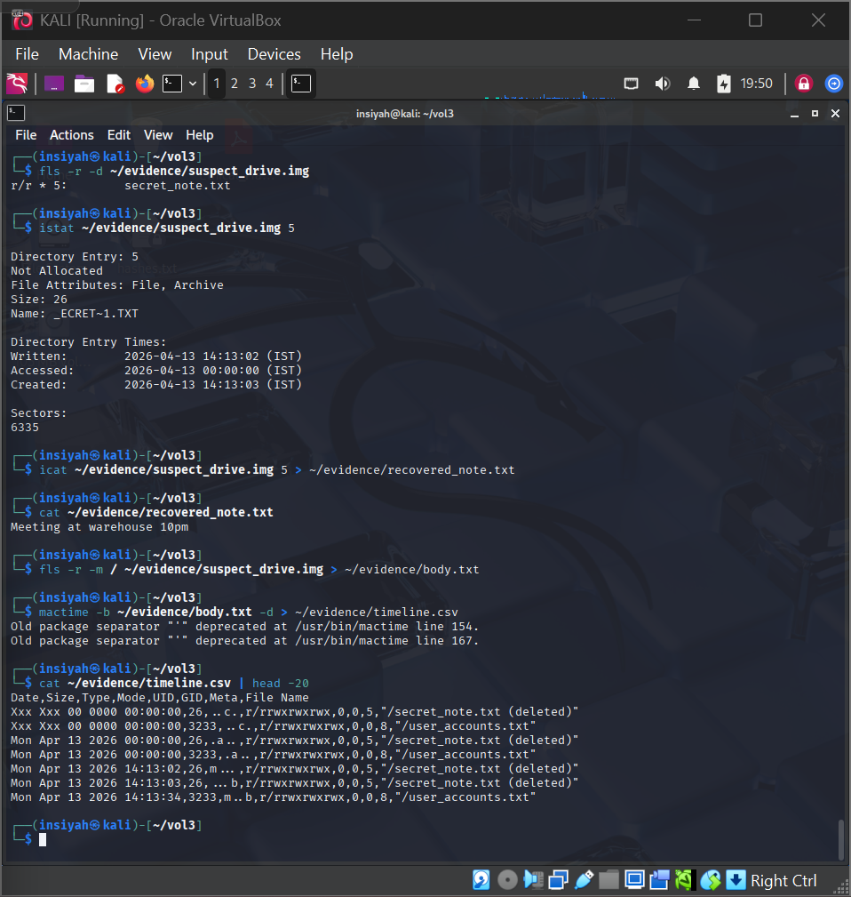
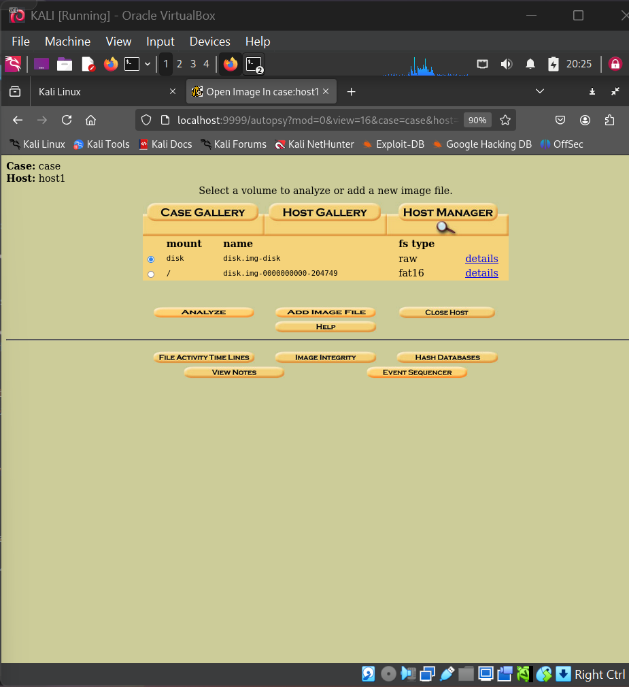

# Lab 05 — Computer Forensics using Autopsy

**Tools:** Autopsy · Sleuth Kit (`fls`, `istat`, `icat`) · `mactime`  
**Platform:** Kali Linux

---

## Aim

To perform computer forensics using Autopsy — including disk image analysis, deleted file recovery, and timeline generation.

## Theory

Autopsy is a GUI-based digital forensics platform built on top of The Sleuth Kit. It allows investigators to:
- Analyze disk images (`.img`, `.E01`, `.dd`)
- Browse file system contents
- Recover deleted files using inode analysis
- Generate MAC time (Modified, Accessed, Created) timelines
- Extract artifacts like browser history, emails, and metadata

---

## Procedure

**Create a test disk image with deleted files**
```bash
dd if=/dev/zero of=~/evidence/suspect_drive.img bs=1M count=200
sudo apt install dosfstools -y && mkfs.vfat -F 32 ~/evidence/suspect_drive.img
sudo mkdir -p /mnt/suspect && sudo mount -o loop ~/evidence/suspect_drive.img /mnt/suspect
echo 'Meeting at warehouse 10pm' | sudo tee /mnt/suspect/secret_note.txt
sudo cp /etc/passwd /mnt/suspect/user_accounts.txt
sudo rm /mnt/suspect/secret_note.txt       # simulate deletion
sudo umount /mnt/suspect
```

**Sleuth Kit — find & recover deleted files**
```bash
sudo apt install sleuthkit -y
fls -r -l ~/evidence/suspect_drive.img         # list all files
fls -r -d ~/evidence/suspect_drive.img         # list deleted files only
istat ~/evidence/suspect_drive.img 5           # get inode details
icat ~/evidence/suspect_drive.img 5 > ~/evidence/recovered_note.txt
cat ~/evidence/recovered_note.txt
```

**Generate timeline**
```bash
fls -r -m / ~/evidence/suspect_drive.img > ~/evidence/body.txt
mactime -b ~/evidence/body.txt -d > ~/evidence/timeline.csv
cat ~/evidence/timeline.csv | head -20
```

**Autopsy GUI**
```bash
sudo autopsy &
# Open browser: http://localhost:9999/autopsy
```

---

## Screenshots

| Step | Screenshot |
|------|------------|
| Disk image creation & file system mounting |  |
| `fls`, `istat`, & `icat` recovery commands |  |
| Timeline generation & activity analysis |  |
| Autopsy GUI volume & case analysis |  |

---

## Conclusion

Autopsy and Sleuth Kit successfully recovered a deleted file from the disk image using inode-level carving. Timeline analysis reconstructed file activity. This demonstrates the power of file system forensics in recovering evidence even after deletion.
