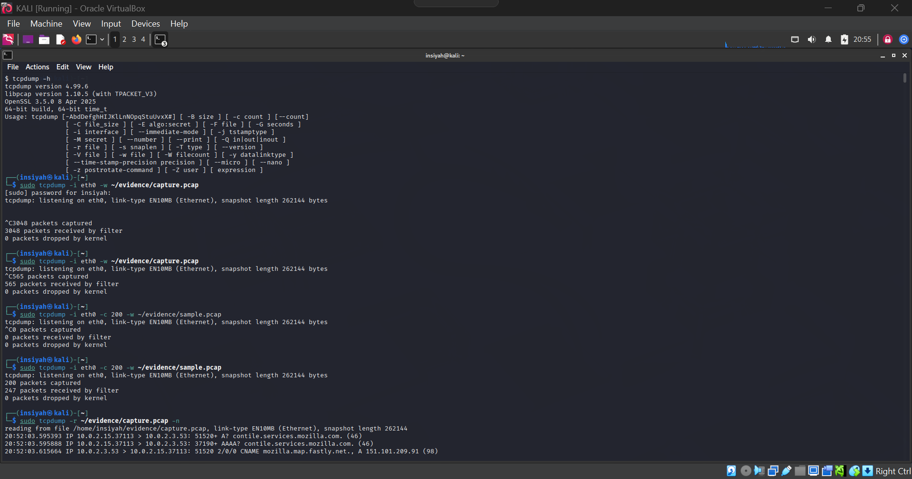
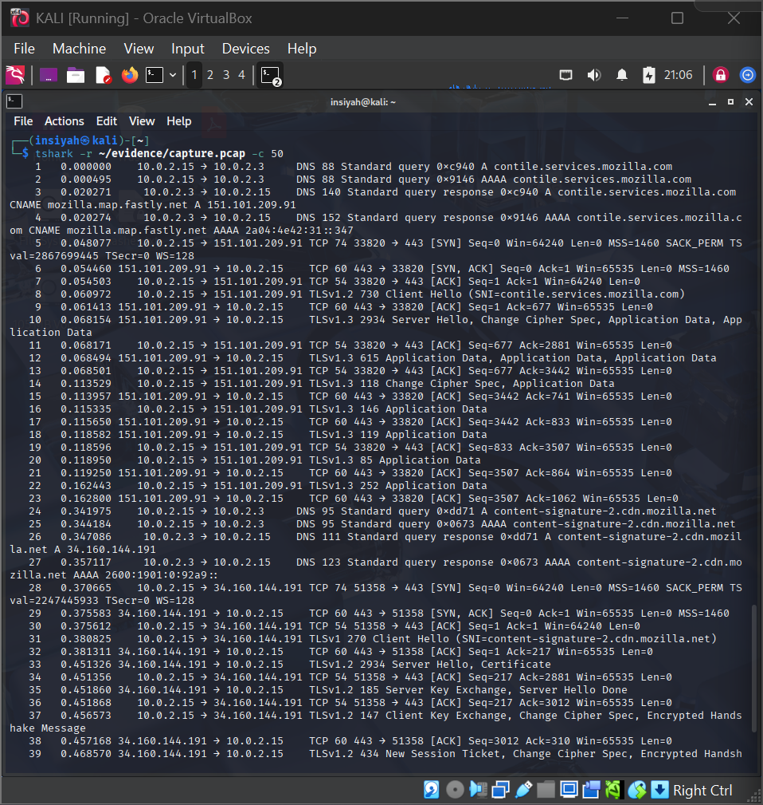

# Lab 06 — Network Analysis using Wireshark and TCPDump

**Tools:** Wireshark · tcpdump · tshark  
**Platform:** Kali Linux

---

## Aim

To perform network analysis using Wireshark and TCPDump for capturing and analyzing network packets.

## Theory

Network forensics involves capturing and analyzing network traffic to detect intrusions, data exfiltration, or suspicious communication. Two primary tools are used:

- **tcpdump** — command-line packet capture; writes `.pcap` files
- **Wireshark / tshark** — GUI and CLI analysis of `.pcap` files with advanced filtering

---

## Procedure

**Setup**
```bash
sudo apt install wireshark tcpdump tshark -y
sudo usermod -aG wireshark $USER && newgrp wireshark
ip link show
```

**Capture packets with TCPDump**
```bash
sudo tcpdump -i eth0 -w ~/evidence/capture.pcap           # capture all
sudo tcpdump -i eth0 -c 200 -w ~/evidence/sample.pcap     # limit to 200 packets
sudo tcpdump -i eth0 port 80 -w ~/evidence/http.pcap      # HTTP only
sudo tcpdump -i eth0 port 53 -w ~/evidence/dns.pcap       # DNS only
sudo tcpdump -r ~/evidence/capture.pcap -n                # read and display
sudo tcpdump -r ~/evidence/capture.pcap -A | head -60     # ASCII output
```

**TShark — advanced analysis**
```bash
# Extract HTTP fields
tshark -r ~/evidence/capture.pcap -Y http.request \
  -T fields -e http.host -e http.request.uri -e http.request.method

# Extract unique DNS queries
tshark -r ~/evidence/dns.pcap -Y 'dns.flags.response == 0' \
  -T fields -e dns.qry.name | sort -u

# Export HTTP objects (files transferred)
mkdir -p ~/evidence/http_objects
tshark -r ~/evidence/capture.pcap --export-objects http,~/evidence/http_objects/
```

**Useful Wireshark display filters**

| Filter | Purpose |
|--------|---------|
| `http` | HTTP traffic only |
| `dns` | DNS queries/responses |
| `tcp.flags.syn == 1` | TCP SYN (connection attempts) |
| `ip.src == 192.168.1.1` | Traffic from specific IP |
| `frame contains "password"` | Keyword search in packets |

---

## Screenshots

| Step | Screenshot |
|------|------------|
| tcpdump capture |  |
| tshark analysis / Wireshark GUI |  |

---

## Conclusion

Wireshark and tcpdump were used to capture and analyze live network traffic. Protocol-specific filters revealed HTTP requests, DNS lookups, and potential data flows. Network forensics is essential for detecting exfiltration, C2 communication, and unauthorized access.
