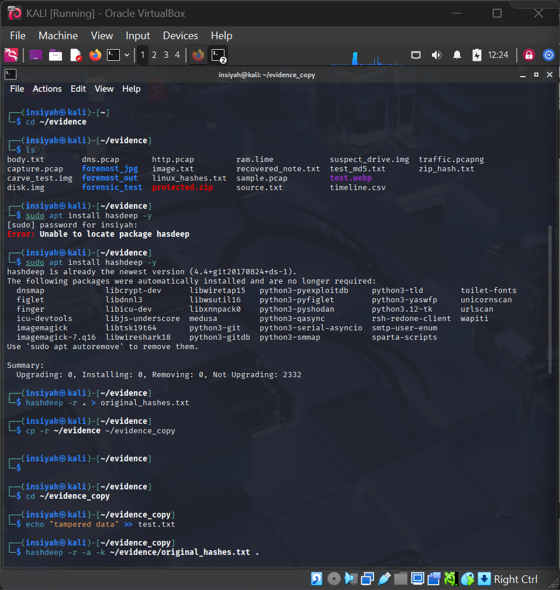
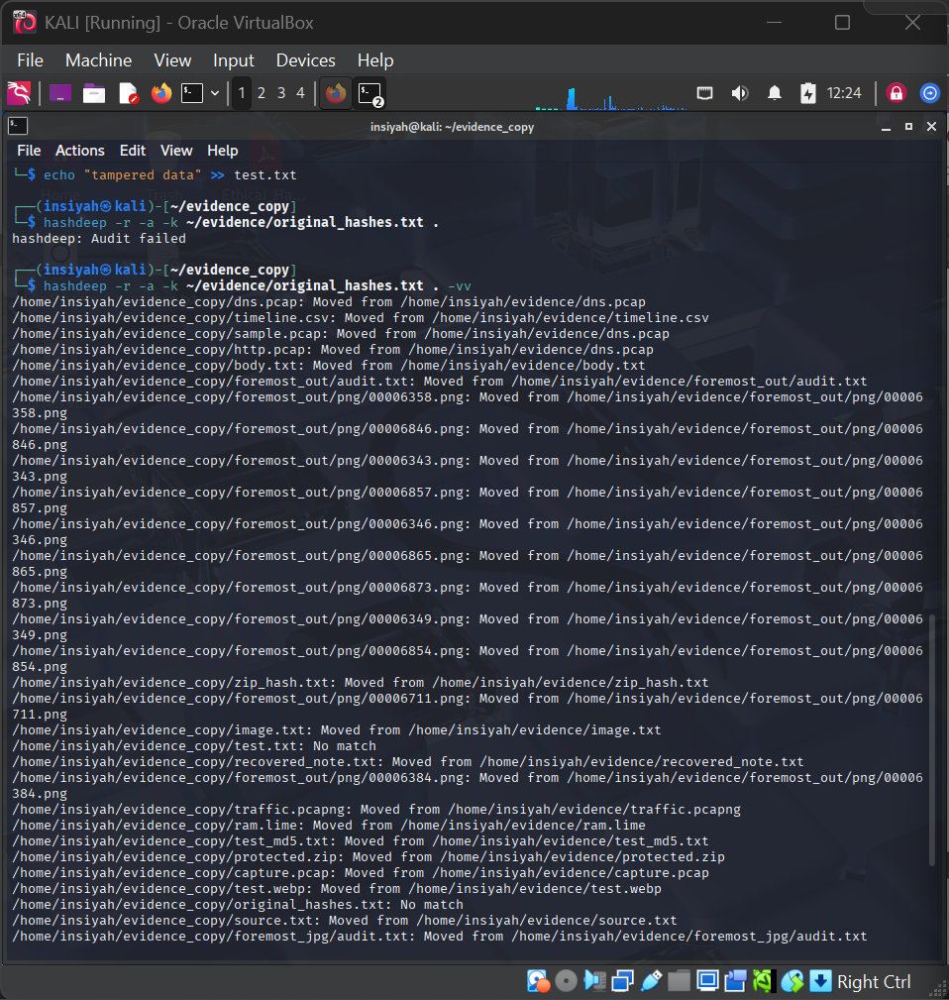
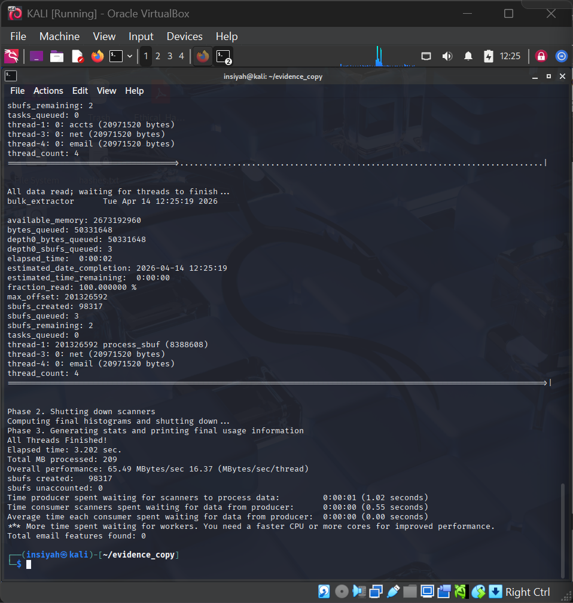
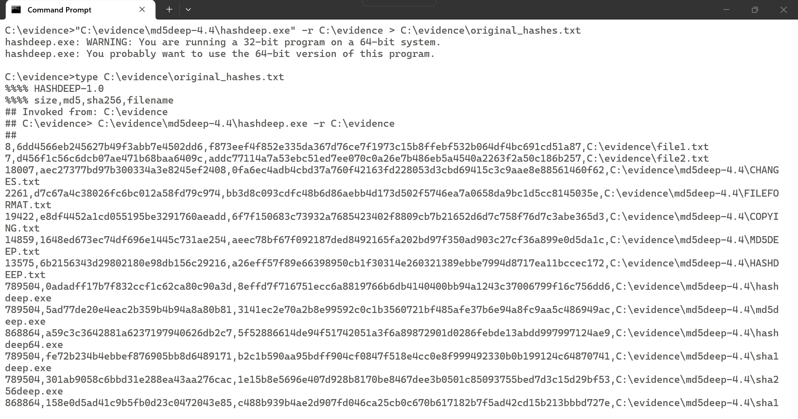
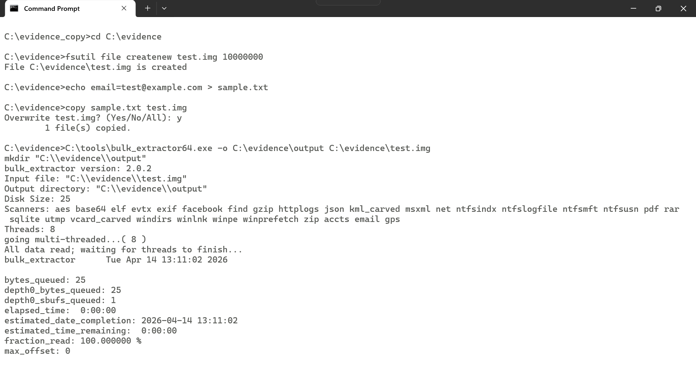

# Lab 08 — Hashing and Data Carving using Hashdeep and Bulk Extractor

**Tools:** Hashdeep · Bulk Extractor  
**Platform:** Kali Linux

---

## Aim

To perform file integrity verification using Hashdeep and extract forensic artifacts from a disk image using Bulk Extractor.

## Theory

### Hashing for Integrity
Cryptographic hashes (MD5, SHA-1, SHA-256) produce a unique fixed-length fingerprint for any data. If even one bit changes, the hash changes — making hashing the gold standard for proving evidence integrity in court.

**Hashdeep** computes multi-algorithm hashes across entire directories and can audit them later to detect any tampering.

### Data Carving
**Bulk Extractor** scans raw disk images or memory dumps for recognizable data patterns — emails, URLs, credit card numbers, GPS coordinates, and EXIF metadata — without needing a mounted file system or intact partition table.

---

## Procedure

**Hashdeep — create a baseline**
```bash
sudo apt install hashdeep -y
mkdir -p ~/evidence/hashtest && cp /etc/passwd /etc/hosts ~/evidence/hashtest/
hashdeep -r -c md5,sha1,sha256 ~/evidence/hashtest/ | tee ~/evidence/baseline.txt
```

**Hashdeep — audit for tampering**
```bash
hashdeep -r -a -v -k ~/evidence/baseline.txt ~/evidence/hashtest/ 2>&1
```

**Bulk Extractor — carve artifacts from disk image**
```bash
sudo apt install bulk-extractor -y
mkdir -p ~/evidence/be_output
bulk_extractor -o ~/evidence/be_output ~/evidence/disk.img
ls -lh ~/evidence/be_output/
```

**Read Bulk Extractor results**
```bash
cat ~/evidence/be_output/email.txt
cat ~/evidence/be_output/url_histogram.txt | sort -t$'\t' -k2 -rn | head -20
cat ~/evidence/be_output/exif.txt | grep -i 'gps\|lat\|lon'
```

### Bulk Extractor Output Files

| File | Contents |
|------|----------|
| `email.txt` | Extracted email addresses |
| `url.txt` | URLs found in the image |
| `url_histogram.txt` | URL frequency counts |
| `exif.txt` | Image EXIF metadata (GPS, device info) |
| `ccn.txt` | Credit card numbers |
| `json.txt` | JSON fragments |

---

## Screenshots

| Step | Screenshot |
|------|------------|
| Hashdeep baseline creation |  |
| Hashdeep audit result |  |
| Bulk Extractor scan running |  |
| Extracted artifacts (email/URL/EXIF) |  |
| GPS metadata from EXIF |  |

---

## Conclusion

Hashdeep verified file integrity using multi-algorithm hashing, detecting any modification since the baseline. Bulk Extractor successfully carved emails, URLs, and EXIF metadata from the raw disk image, demonstrating how deleted or hidden data can be recovered without mounting the file system.
