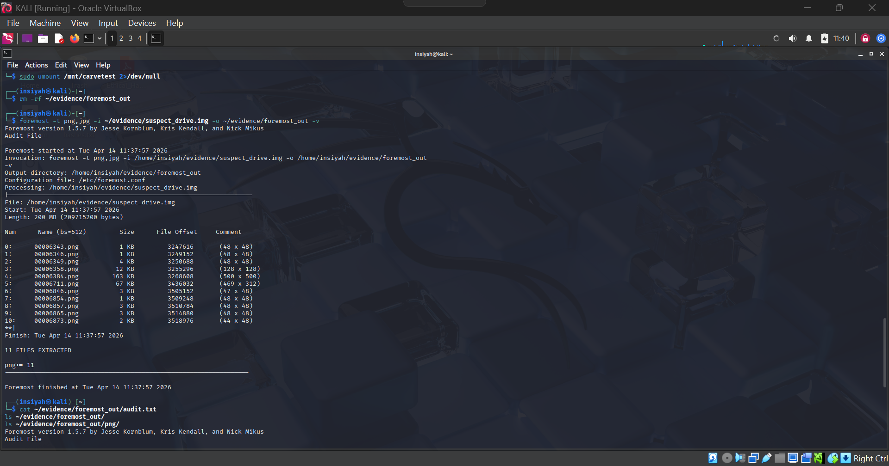
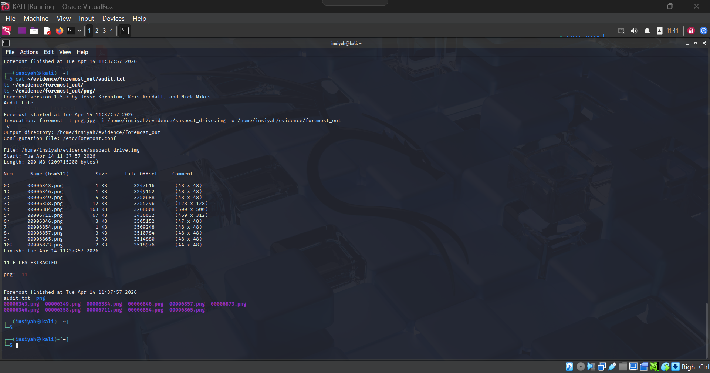
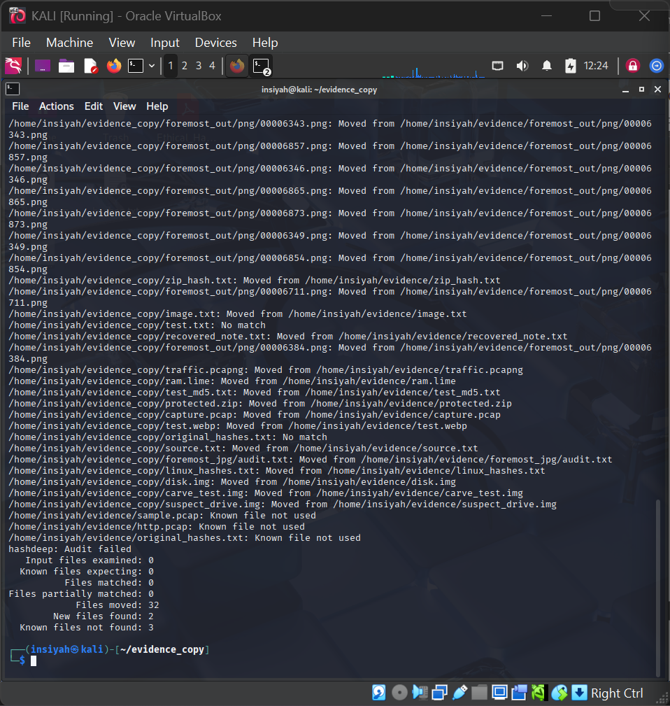
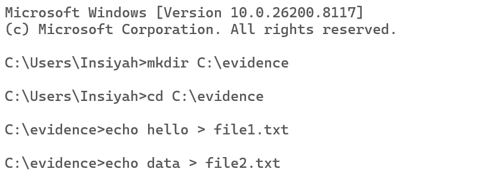
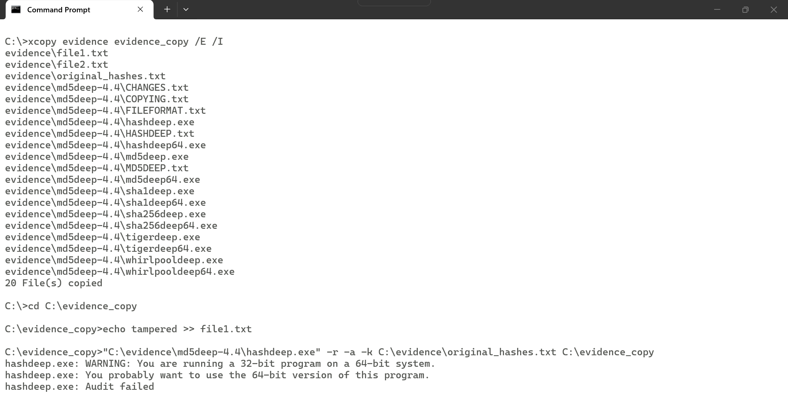

# Lab 09 — Recovering Evidence using Foremost

**Tools:** Foremost · ExifTool  
**Platform:** Kali Linux

---

## Aim

To recover deleted files from a disk image using Foremost file carving, and extract metadata from recovered files using ExifTool.

## Theory

**Foremost** is a file carving tool that recovers files by scanning for known file signatures (magic bytes) at the start and end of file types — independent of the file system. It works even when:
- Files have been deleted
- The partition table is corrupted
- The file system is unrecognized

Supported types include: JPG, PNG, GIF, PDF, DOC, ZIP, AVI, and more.

---

## Procedure

**Create a test image with deleted files**
```bash
dd if=/dev/zero of=~/evidence/carve_test.img bs=1M count=200
mkfs.vfat -F 32 ~/evidence/carve_test.img
sudo mount -o loop ~/evidence/carve_test.img /mnt/carvetest
sudo cp /usr/share/backgrounds/*.jpg /mnt/carvetest/ 2>/dev/null    # copy files
sudo rm -rf /mnt/carvetest/*                                         # delete them
sudo umount /mnt/carvetest
```

**Run Foremost — recover all file types**
```bash
sudo apt install foremost -y
mkdir -p ~/evidence/foremost_out
foremost -i ~/evidence/carve_test.img -o ~/evidence/foremost_out -v
```

**Target specific file types**
```bash
foremost -t jpg -i ~/evidence/carve_test.img -o ~/evidence/foremost_jpg -v
foremost -t jpg,pdf,doc,zip -i ~/evidence/carve_test.img -o ~/evidence/foremost_multi -v
```

**Check recovery results**
```bash
ls -lh ~/evidence/foremost_out/
cat ~/evidence/foremost_out/audit.txt           # summary report
file ~/evidence/foremost_out/jpg/00000000.jpg   # verify file type
```

**Extract EXIF metadata from recovered images**
```bash
sudo apt install libimage-exiftool-perl -y
exiftool ~/evidence/foremost_out/jpg/00000000.jpg
```

### Foremost Audit Report Fields

| Field | Meaning |
|-------|---------|
| `Filename` | Recovered file name |
| `Start` | Byte offset where file was found |
| `Size` | File size |
| `Comment` | File type / detection method |

---

## Screenshots

| Step | Screenshot |
|------|------------|
| Test image creation & file deletion |  |
| Foremost scan running |  |
| Recovered files listing |  |
| Audit report output |  |
| ExifTool metadata extraction |  |

---

## Conclusion

Foremost successfully recovered deleted JPEG images from the disk image using file signature carving, without relying on the file system. ExifTool extracted embedded metadata from the recovered files. This technique is valuable for recovering photos, documents, and other evidence from formatted or damaged drives.
