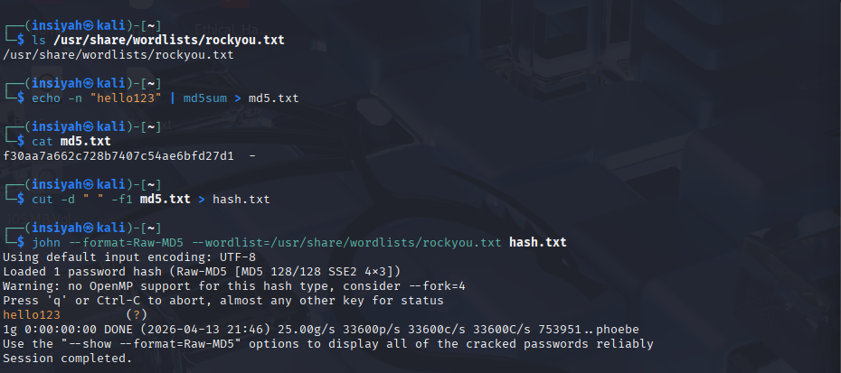
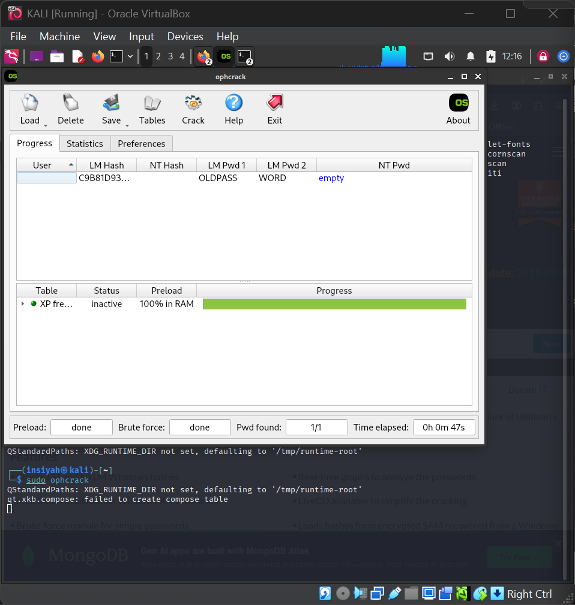

# Lab 10 — Password Cracking using John the Ripper

**Tools:** John the Ripper · Ophcrack · `zip2john` · `unshadow`  
**Platform:** Kali Linux

---

## Aim

To perform password cracking using John the Ripper against Linux shadow hashes, raw MD5 hashes, and password-protected ZIP files.

## Theory

Password forensics is used to recover access to encrypted files or accounts during an investigation. John the Ripper supports:

- **Dictionary attack** — tries words from a wordlist (e.g., `rockyou.txt`)
- **Rules-based attack** — applies mutations (capitalization, substitution) to wordlist entries
- **Brute-force** — systematically tries all character combinations

Hash formats supported include MD5, SHA-1, bcrypt, NTLM, LM, and many more.

---

## Procedure

**Setup John the Ripper**
```bash
sudo apt install john -y
john --version
sudo gunzip /usr/share/wordlists/rockyou.txt.gz
```

**Crack Linux shadow passwords**
```bash
sudo unshadow /etc/passwd /etc/shadow > ~/evidence/linux_hashes.txt
john --wordlist=/usr/share/wordlists/rockyou.txt ~/evidence/linux_hashes.txt
john --wordlist=/usr/share/wordlists/rockyou.txt --rules ~/evidence/linux_hashes.txt
john --show ~/evidence/linux_hashes.txt
```

**Crack a raw MD5 hash**
```bash
echo -n 'hunter2' | md5sum
echo '2ab96390c7dbe3439de74d0c9b0b1767' > ~/evidence/test_md5.txt
john --format=Raw-MD5 --wordlist=/usr/share/wordlists/rockyou.txt ~/evidence/test_md5.txt
john --show ~/evidence/test_md5.txt
```

**Crack a password-protected ZIP**
```bash
zip --password secret99 ~/evidence/protected.zip /etc/hostname
zip2john ~/evidence/protected.zip > ~/evidence/zip_hash.txt
john --wordlist=/usr/share/wordlists/rockyou.txt ~/evidence/zip_hash.txt
john --show ~/evidence/zip_hash.txt
```

**Windows NTLM hashes — Ophcrack**
```bash
sudo apt install ophcrack -y
sudo ophcrack &
```

### Common John the Ripper Flags

| Flag | Purpose |
|------|---------|
| `--wordlist=` | Specify wordlist file |
| `--rules` | Apply mangling rules |
| `--format=` | Specify hash format |
| `--show` | Display cracked passwords |
| `--incremental` | Pure brute-force mode |

---

## Screenshots

| Step | Screenshot |
|------|------------|
| MD5 hash cracking with John the Ripper |  |
| Windows NTLM cracking with Ophcrack |  |

---

## Conclusion

John the Ripper successfully cracked Linux shadow passwords, raw MD5 hashes, and a ZIP file password using dictionary attacks with rockyou.txt. This demonstrates the importance of using strong, unique passwords and modern hashing algorithms (bcrypt, Argon2) in production systems.
