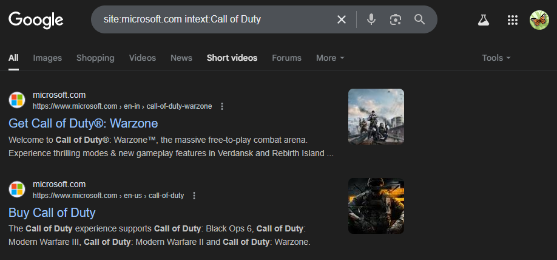
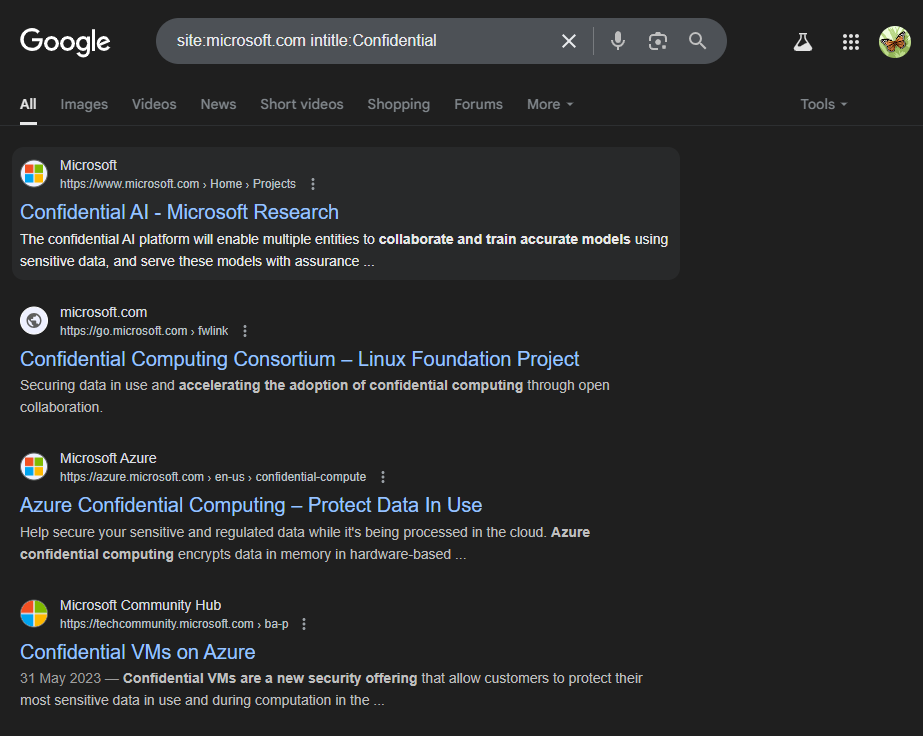
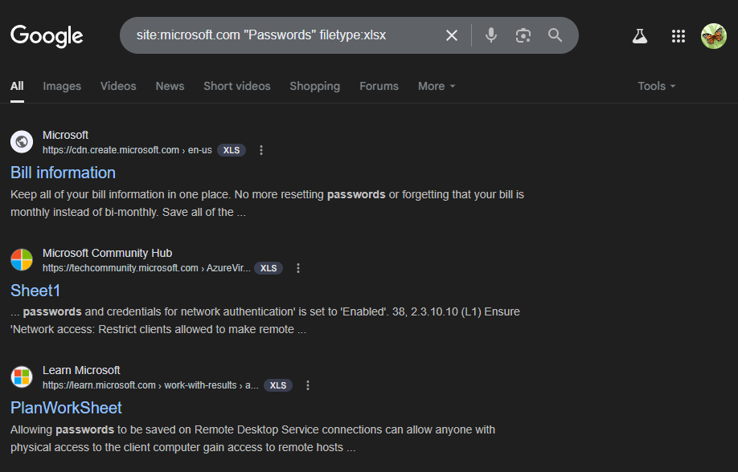
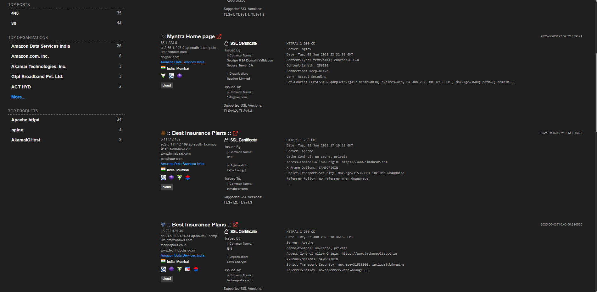
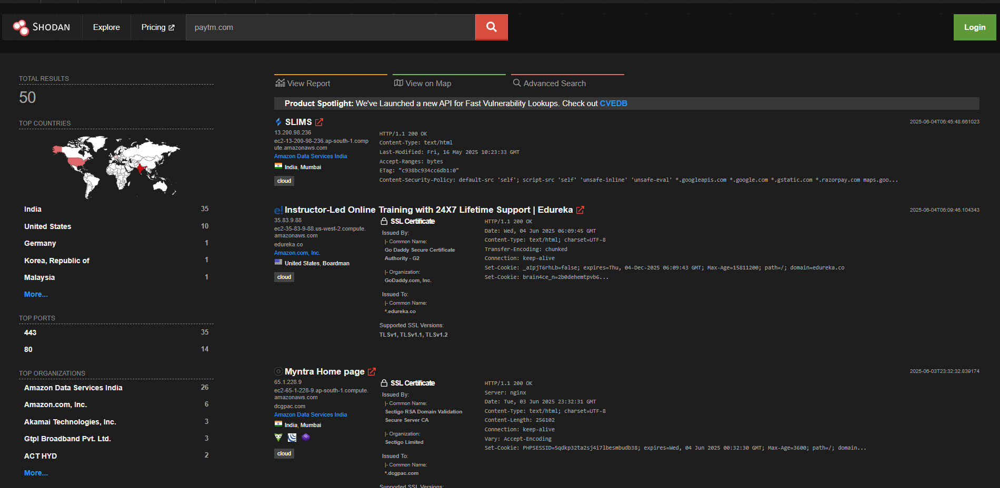

# Assignment 1 — Advanced Google Search Operators & Shodan Domain Recon

**Tools:** Google Search · Shodan.io  
**Platform:** Web browser

---

## Objective

Perform 10 advanced Google search operations using Google Dork operators and gather domain details for a target website using Shodan.io.

---

## Theory

### Google Dorks
Google dorks are advanced search queries using special operators to find specific information indexed by Google — including exposed files, login portals, vulnerable servers, and sensitive documents. Commonly used in OSINT (Open Source Intelligence) gathering.

### Shodan.io
Shodan is a search engine for internet-connected devices. Unlike Google which indexes web content, Shodan scans IP addresses and indexes metadata such as open ports, running services, banners, SSL certificates, and geolocation — making it invaluable for passive reconnaissance.

---

## Google Dork Operators Used

| # | Operator | Query Example | Purpose |
|---|----------|---------------|---------|
| 1 | `site:` | `site:example.com` | Restrict results to a specific domain |
| 2 | `intitle:` | `intitle:"index of"` | Search within page titles |
| 3 | `inurl:` | `inurl:admin login` | Search within URLs |
| 4 | `filetype:` | `filetype:pdf confidential` | Find specific file types |
| 5 | `intext:` | `intext:"password" filetype:txt` | Search within page body text |
| 6 | `cache:` | `cache:example.com` | View Google's cached version |
| 7 | `link:` | `link:example.com` | Find pages linking to a domain |
| 8 | `related:` | `related:example.com` | Find similar websites |
| 9 | `"exact phrase"` | `"login page" inurl:admin` | Exact phrase match |
| 10 | `-` (exclude) | `site:example.com -www` | Exclude keywords from results |

---

## Shodan Recon

**Target domain lookup on Shodan:**
```
https://www.shodan.io/domain/<target-domain>
```

**Information gathered:**
- Open ports and running services
- Server software and version
- SSL/TLS certificate details
- Geolocation (country, city, ISP)
- CVEs associated with detected software versions
- Historical scan data

**Shodan search filters:**
```
hostname:example.com
ip:<target-ip>
port:22 country:IN
org:"target organization"
```

---

## Screenshots

| # | Description | Screenshot |
|---|-------------|------------|
| 1 | `site:` operator — indexed pages |  |
| 2 | `intitle:` operator — page title search |  |
| 3 | `inurl:` operator — URL search |  |
| 4 | `filetype:pdf` — document search |  |
| 5 | `intext:` operator — body content search |  |
| 6 | Exact phrase match operator |  |
| 7 | Combined operators query |  |
| 8 | Shodan — domain lookup results |  |
| 9 | Shodan — open ports & services |  |
| 10 | Shodan — CVEs / SSL certificate details |  |

---

## Conclusion

Using Google dork operators, specific file types, exposed directories, admin panels, and indexed sensitive data were identified from publicly available search results. Shodan provided detailed infrastructure information about the target domain — including open ports, service banners, and associated vulnerabilities — without sending a single packet to the target. This passive recon approach is foundational to ethical hacking and digital forensics investigations.
