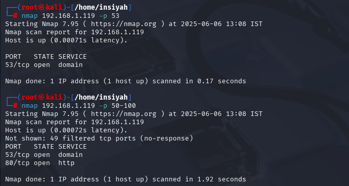
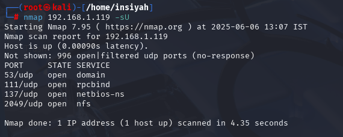
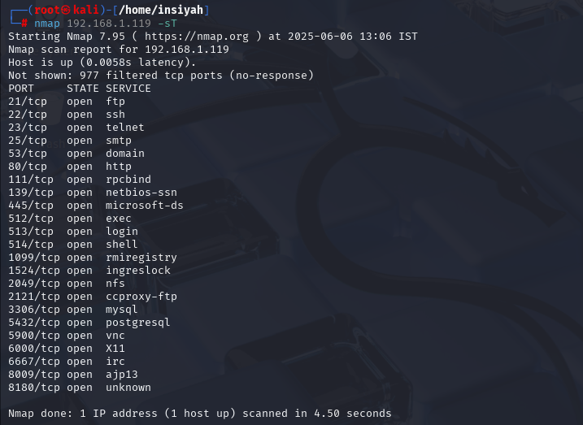
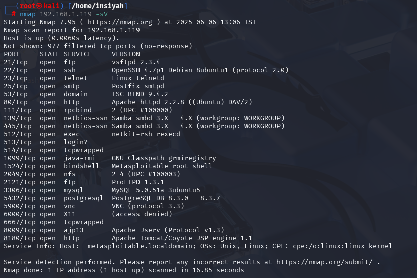
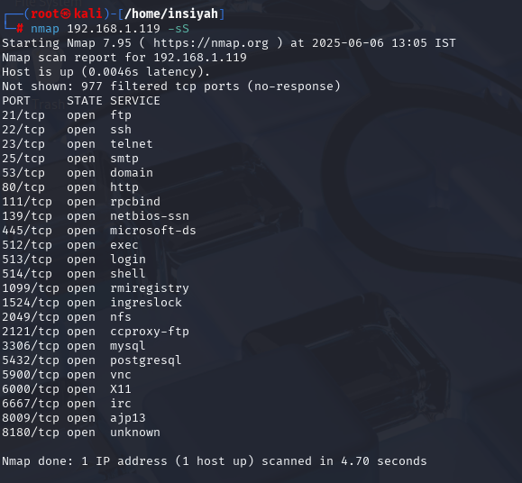
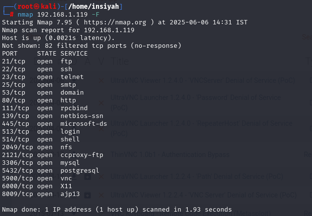
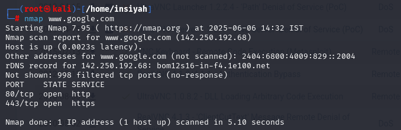
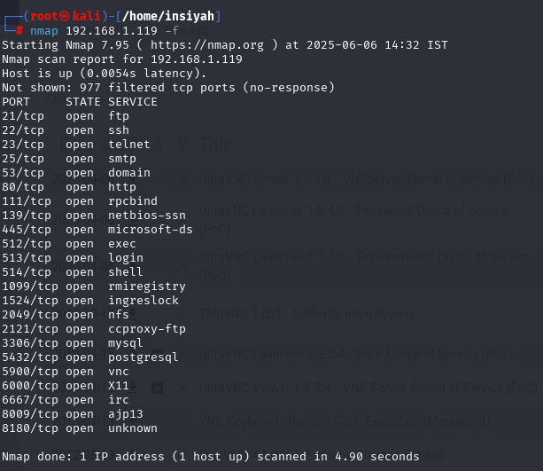
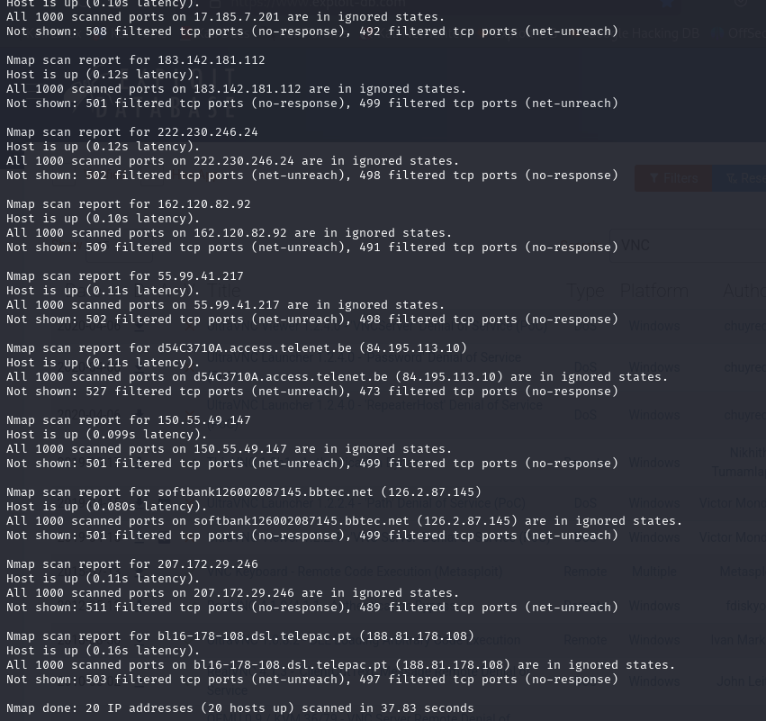
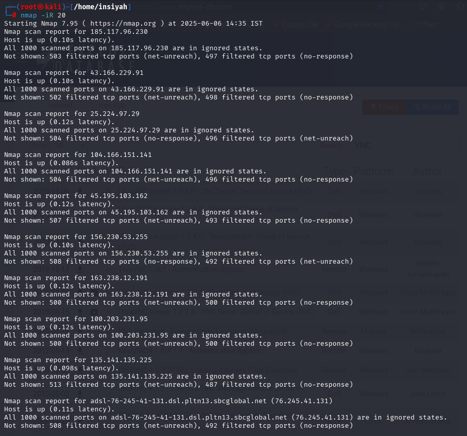

# Assignment 2 — Nmap Commands on Kali Linux & Metasploitable 2

**Tools:** Nmap · Kali Linux · Metasploitable 2  
**Platform:** VMware / VirtualBox — Host-only Network

---

## Objective

Download and set up Kali Linux and Metasploitable 2 in a virtual environment, then perform Nmap network scanning commands against the Metasploitable target.

---

## Theory

### Nmap (Network Mapper)
Nmap is the industry-standard open-source tool for network discovery and security auditing. It can:
- Discover live hosts on a network
- Identify open ports and running services
- Detect OS and service versions
- Run vulnerability detection scripts (NSE)

### Metasploitable 2
Metasploitable 2 is an intentionally vulnerable Linux VM designed as a safe target for practicing penetration testing and security scanning. It runs services like FTP (vsftpd 2.3.4 backdoor), SSH, HTTP (DVWA), MySQL, and more — all with known vulnerabilities.

---

## Lab Setup

```
┌─────────────────┐        Host-only Network        ┌──────────────────────┐
│   Kali Linux    │ ──────── 192.168.x.0/24 ──────── │  Metasploitable 2    │
│ (attacker VM)   │                                  │  (target VM)         │
│ 192.168.x.130   │                                  │  192.168.x.129       │
└─────────────────┘                                  └──────────────────────┘
```

**Find Metasploitable IP:**
```bash
# On Metasploitable VM
ifconfig

# From Kali — scan the subnet
nmap -sn 192.168.56.0/24
```

---

## Nmap Commands Performed

### 1. Ping Sweep — Discover live hosts
```bash
nmap -sn 192.168.56.0/24
```

### 2. Basic Port Scan — Top 1000 ports
```bash
nmap 192.168.56.129
```

### 3. SYN Scan (Stealth) — Half-open scan
```bash
sudo nmap -sS 192.168.56.129
```

### 4. Service & Version Detection
```bash
nmap -sV 192.168.56.129
```

### 5. OS Detection
```bash
sudo nmap -O 192.168.56.129
```

### 6. Aggressive Scan — OS + version + scripts + traceroute
```bash
sudo nmap -A 192.168.56.129
```

### 7. All Ports Scan — Full 65535 ports
```bash
nmap -p- 192.168.56.129
```

### 8. UDP Scan
```bash
sudo nmap -sU --top-ports 20 192.168.56.129
```

### 9. Vulnerability Scripts (NSE)
```bash
nmap --script vuln 192.168.56.129
```

### 10. Save Output to File
```bash
nmap -oN ~/nmap_results.txt -sV 192.168.56.129
nmap -oX ~/nmap_results.xml -sV 192.168.56.129
```

---

## Nmap Flag Reference

| Flag | Meaning |
|------|---------|
| `-sS` | TCP SYN (stealth) scan |
| `-sT` | TCP connect scan |
| `-sU` | UDP scan |
| `-sV` | Service/version detection |
| `-O` | OS detection |
| `-A` | Aggressive (OS + version + scripts + traceroute) |
| `-p-` | Scan all 65535 ports |
| `-sn` | Ping sweep (no port scan) |
| `--script` | Run NSE script(s) |
| `-oN` | Output to normal text file |
| `-oX` | Output to XML file |

---

## Screenshots

| # | Command | Screenshot |
|---|---------|------------|
| 1 | Kali Linux setup & VM network config |  |
| 2 | Metasploitable 2 boot & IP detection |  |
| 3 | Ping sweep — `nmap -sn` |  |
| 4 | Basic port scan |  |
| 5 | SYN stealth scan `-sS` |  |
| 6 | Version detection `-sV` |  |
| 7 | OS detection `-O` |  |
| 8 | Aggressive scan `-A` |  |
| 9 | NSE vulnerability scripts |  |
| 10 | Full port scan / output saved |  |

---

## Conclusion

Nmap successfully scanned the Metasploitable 2 target and revealed multiple open ports including FTP (21), SSH (22), HTTP (80), MySQL (3306), and others. Service version detection identified vulnerable software versions, and NSE scripts flagged known CVEs. This demonstrates how a real attacker performs network reconnaissance before exploitation.
